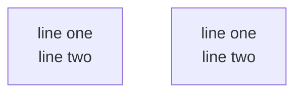

# Agent Instructions — myMantra

## Skills

| Skill               | File                                        | When to use                        |
| ------------------- | ------------------------------------------- | ---------------------------------- |
| `implement-feature` | `.agents/skills/implement-feature/SKILL.md` | Adding any new user-facing feature |
| `fix-bug`           | `.agents/skills/fix-bug/SKILL.md`           | Diagnosing and fixing a bug        |
| `on-git-ci-failure` | `.agents/skills/on-git-ci-failure/SKILL.md` | CI pipeline is red                 |
| `local-ci`          | `.agents/skills/local-ci/SKILL.md`          | Run full CI locally before pushing |

---

## Mermaid diagrams

In Mermaid, use `<br>` for line breaks inside labels — not `\n`. Most renderers do not support `\n` inside node labels.



**Flow Charts**:

 use circles `(())` for start and end states,
 rectangles `[]` for actions,
 rounded rectangles `([])` for state/screen,
 square `{}` for decisions.
 attributes that are non-flow should be with dashed arrow
 use coloring of object to emphasize or to consistency between charts within a document.

```mermaid
graph TD
    %% Styling Definitions
    classDef startEnd fill:#f9f,stroke:#333,stroke-width:2px;
    classDef action fill:#fff,stroke:#333,stroke-width:2px;
    classDef screen fill:#e1f5fe,stroke:#01579b,stroke-width:2px;
    classDef decision fill:#fff9c4,stroke:#fbc02d,stroke-width:2px;

    %% Nodes
    S((Start)):::startEnd
    Login([Login Screen]):::screen
    Input[Enter Credentials]:::action
    Auth{Valid?}:::decision
    Dashboard([User Dashboard]):::screen
    E((End)):::startEnd

    %% Non-flow Attribute
    SessionData[Session Timeout: 30m]

    %% Flow
    S --> Login
    Login --> Input
    Input --> Auth
    Auth -- No --> Login
    Auth -- Yes --> Dashboard
    Dashboard --> E

    %% Dashed link for non-flow attribute
    Login -.- SessionData
  ```

---

## Settings and Configurations

Always prefer externalising settings, lists, and configuration into data files rather than hardcoding values in Dart (or any other code) files.

- **YAML** (`assets/data/*.yml`) — human-readable lists and structured configuration (e.g. themes, icon catalogues).
- **JSON** (`assets/data/*.json`, `target.json`) — machine-consumed configuration and structured data.

Rules:
- If a value could ever change without a code change (colours, labels, IDs, feature flags, asset paths, numeric thresholds), it belongs in a data file.
- Code files may only contain constants that are truly invariant (e.g. mathematical ratios, platform API identifiers).
- When adding a new configurable value, check whether an appropriate data file already exists before creating a new one.
- Data files under `assets/` must be declared in `pubspec.yaml` to be bundled with the app.

## Git commits
every git commit should start with:
 - feat: description
 - fix: description
 - test: description
 - doc: description
 - refactor: description
 or similar notation

merge commits:
 - merge: from 'branch-name-without-prefix-remote' to 'branch-name-without-prefix-remote'

every commit done by an AI agent will be added a footnote:

Co-authored-by: Agent Name, Version, email.

Examples:

authored-by: Elkana Bronstein <elkana.bronstein@gmail.com>
Co-authored-by: Claude Opus 4.5 <noreply@anthropic.com>
Co-authored-by: Gemini 3.0 Flash <noreply@google.com>
Co-authored-by: GPT-5.1 Codex <noreply@openai.com>
Co-authored-by: GitHub Copilot (Claude Sonnet 4.6) <noreply@github.com>
