# MyMantra - Application Flow Chart

## Overview
This document describes the complete user flow through the MyMantra application, including screen navigation and user journeys.

---

## Section 1: Complete Application Flowchart

### Full Application Structure

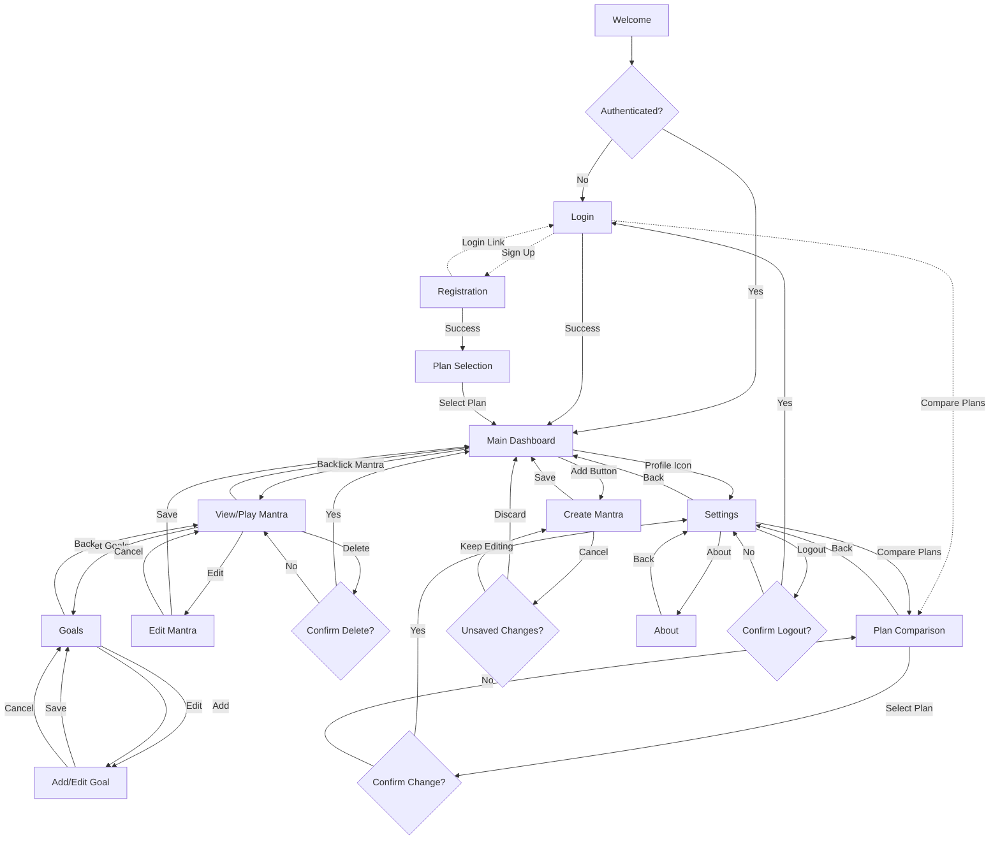

---

## Section 2: Complete User Journeys

### 2.1 First-Time User Journey
New users who have never registered before.

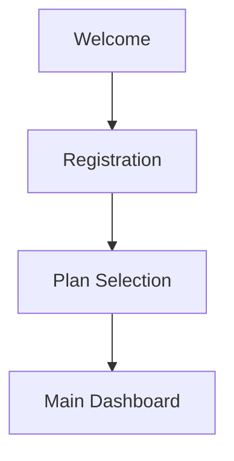

**Steps:**
1. User opens app for first time
2. Welcome screen displays (2-3 seconds)
3. Auto-proceeds to Registration
4. User creates account
5. User selects plan (Free or Premium)
6. User arrives at Main Dashboard

---

### 2.2 Returning User Journey
Users who have already registered and logged in.

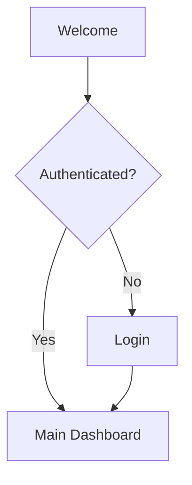

**Steps:**
1. User opens app
2. Welcome screen displays (2-3 seconds)
3. Auto-login check
4. If authenticated: proceed to Main Dashboard
5. If not authenticated: show Login screen

---

### 2.3 Create Mantra Journey

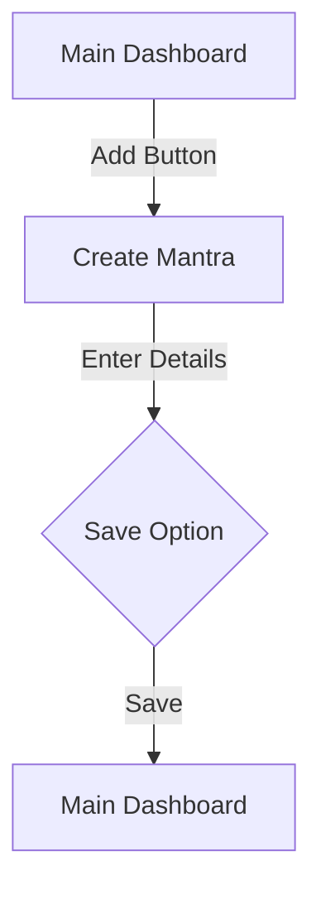

**Steps:**
1. User clicks "+ Add Mantra" button
2. Create Mantra screen opens
3. User can choose between:
   - Creating a user-defined custom mantra
   - Selecting from built-in mantras
4. For user-defined mantras:
   - User enters title and text
   - Optional: Add category, tags
   - Optional: Use voice input to record mantra (premium feature)
   - Optional: Use text-to-speech to generate voice from text (premium feature)
   - Optional: Use translation (premium feature)
5. User saves mantra
6. Returns to Main Dashboard

---

### 2.4 Edit Mantra Journey

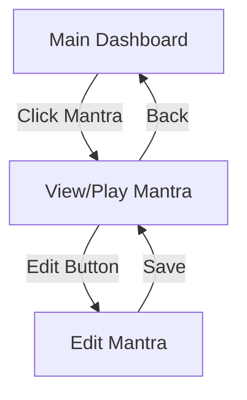

**Steps:**
1. User clicks on a mantra card
2. View/Play Mantra screen opens
3. User clicks Edit button
4. Edit Mantra screen opens with pre-filled data
5. User modifies content
6. User saves changes
7. Returns to View/Play Mantra screen
8. User navigates back to Main Dashboard

---

### 2.5 Delete Mantra Journey

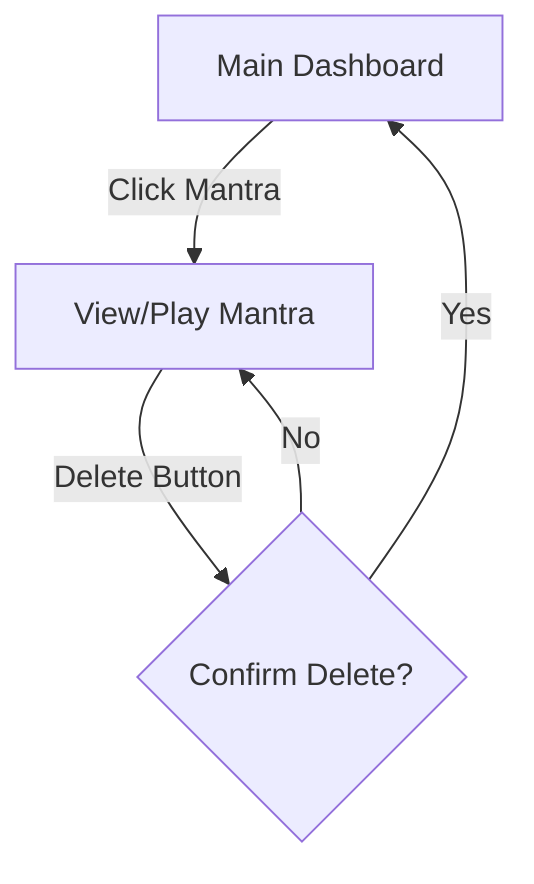

**Steps:**
1. User clicks on a mantra card
2. View/Play Mantra screen opens
3. User clicks Delete button
4. Confirmation dialog appears
5. User confirms deletion
6. Mantra deleted, returns to Main Dashboard

---

### 2.6 Set Goals Journey

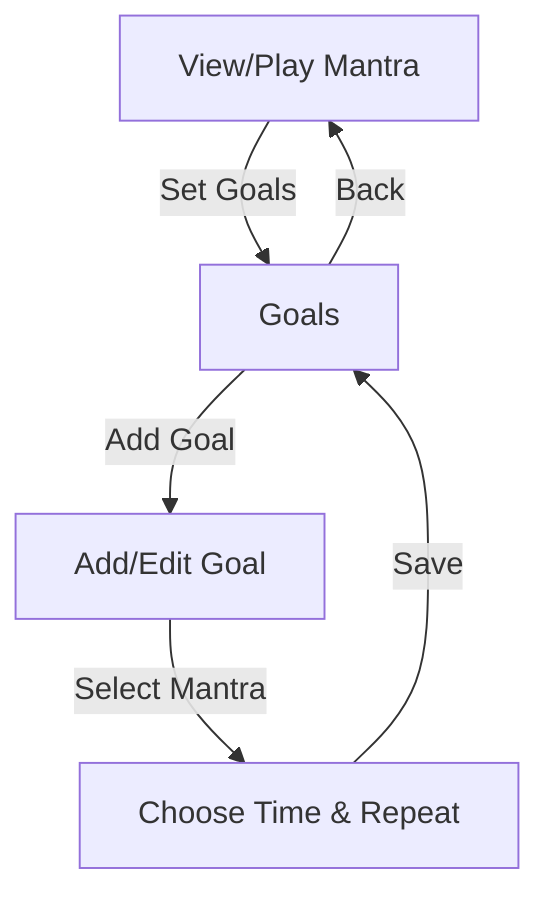

**Note:** Goals are accessed from the View/Play Mantra screen only. Users set practice goals (reminders) for specific mantras to build habits.

**Permission Requirements:**
- When first accessing Goals from View/Play Mantra or Login screens, the app requests notification permissions via a pop-up
- This permission request can appear on different screens as needed

**Steps:**
1. User navigates to Goals from View/Play Mantra screen
2. If first time: system requests notification permissions via pop-up
3. User clicks "+ Add Goal"
4. Mantra is pre-selected (current mantra from View screen)
5. User sets time
6. User sets repeat options (daily, weekdays, custom, once)
7. User saves goal
8. Returns to Goals screen

---

### 2.7 Change Plan Journey

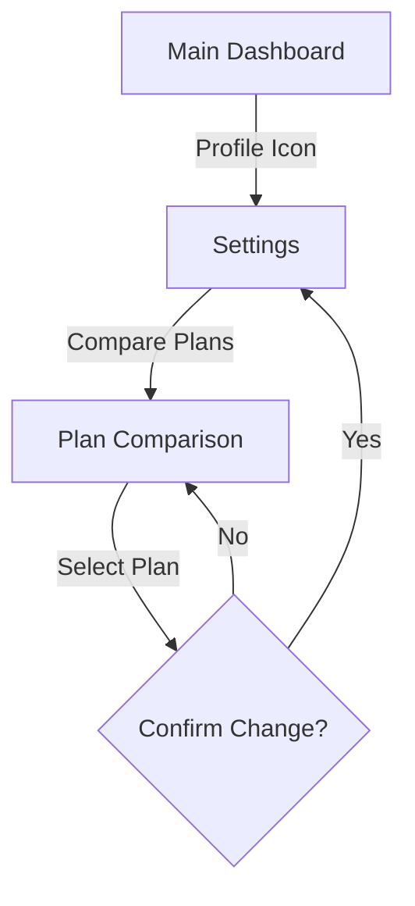

**Alternative entry point:**
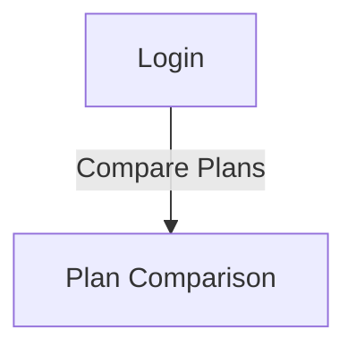

**Steps:**
1. User navigates to Settings
2. User clicks "Compare Plans" or "Upgrade"
3. Plan Comparison screen shows features
4. User selects new plan
5. Confirmation dialog appears
6. User confirms plan change
7. Plan updated, returns to Settings

---

### 2.8 Logout Journey

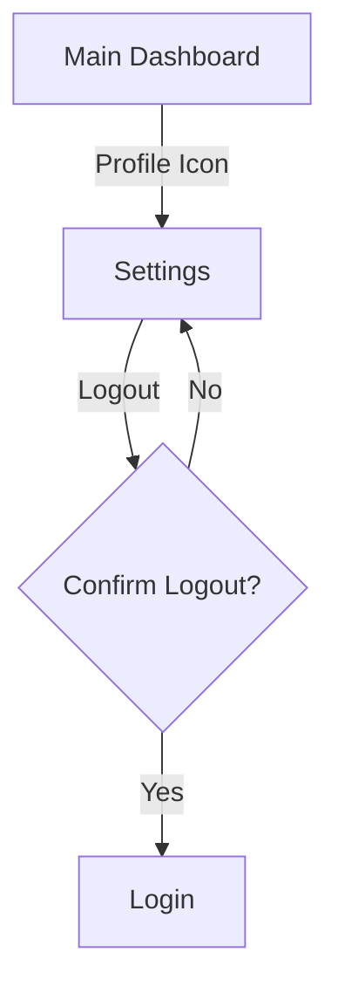

**Steps:**
1. User navigates to Settings
2. User clicks "Logout"
3. Confirmation dialog appears
4. User confirms logout
5. Session cleared, redirected to Login screen

---

### 2.9 Play Mantra (Voice Playback) Journey

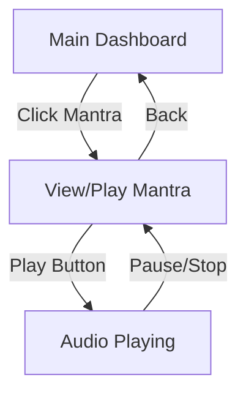

**Steps:**
1. User clicks on a mantra card
2. View/Play Mantra screen opens
3. User clicks Play button (only available if mantra has recorded voice)
4. Recorded voice plays the mantra
5. Playback controls available (pause/stop)
6. User can navigate back when finished

**Note:** Not all mantras have voice recordings. Voice can be added during mantra creation through:
- Recording your own voice (always available)
- Using text-to-speech to generate voice (optional, premium feature)

---

### 2.10 Password Reset Journey

**REMOVED:** Password reset is no longer needed as authentication is exclusively through Google, Apple, or Meta accounts.

---

## Section 3: Individual Screen Details

### 3.1 Welcome
**Purpose:** Brand introduction, animated loading screen

**Elements:**
- Animated lotus opening (GIF/Lottie animation)
- Main mantra text in Sanskrit (overlay)
- Auto-proceeds after 2-3 seconds (no user interaction)

**Navigation:**
- Auto → Login (if not authenticated)
- Auto → Main Dashboard (if authenticated)

---

### 3.2 Login
**Purpose:** Authenticate returning users

**Elements:**
- "Sign in with Google" button
- "Sign in with Apple" button
- "Sign in with Meta" button
- "Don't have an account? Sign Up" link
- "Compare Plans" link (bottom or header)

**Navigation:**
- Login success → Main Dashboard
- Sign Up link → Registration
- Compare Plans link → Plan Comparison

**Permission Requirements:**
- Notification permission pop-up may appear after successful login (if not previously granted)

---

### 3.3 Registration
**Purpose:** Create new user account

**Elements:**
- "Sign up with Google" button
- "Sign up with Apple" button
- "Sign up with Meta" button
- "Already have an account? Login" link
- Terms & Privacy Policy checkbox

**Navigation:**
- Success → Plan Selection
- Login link → Login

**Validation:**
- Terms acceptance required
- OAuth authentication handles email validation

---

### 3.4 Plan Selection
**Purpose:** Choose between available subscription plans

**Elements:**
- Feature comparison table/cards
- Plan options with pricing (if applicable)
- Feature availability indicators per plan
- "Select" button for each plan
- Highlight differences between plans

**Navigation:**
- Select plan → Main Dashboard (first time)
- Also accessible from Settings → Plan Comparison

**Notes:**
- Features are configurable (see Feature Flags section)
- Plan-to-feature mapping determined later

---

### 3.5 Plan Comparison
**Purpose:** View and compare plan features, change current plan

**Elements:**
- Same as Plan Selection
- Shows current plan indicator
- "Change Plan" / "Upgrade" / "Downgrade" options

**Navigation:**
- Accessible from Login and Settings
- Select plan → Confirmation dialog → Settings

---

### 3.6 Main Dashboard
**Purpose:** Central hub, display all user mantras

**Header Elements:**
- App logo/name
- User profile icon → Settings

**Main Content:**
- Search bar (filter mantras by title/text)
- Mantra cards/list items displaying:
  - Mantra title
  - Preview text (first line or excerpt)
  - Category/tag badge (optional)
  - Last modified date
  - Play button icon (only if mantra has voice recording)
- Empty state: "Create your first mantra" with call-to-action
- Floating Action Button (FAB): "+ Add Mantra"

**Bottom Navigation (optional):**
- Home icon (current)
- Settings icon

**Navigation:**
- Click mantra card → View/Play Mantra
- "+ Add Mantra" FAB → Create Mantra
- Profile icon → Settings
- Search filters mantras in real-time

**Note:** Goals are set from the View/Play Mantra screen, not from the Main Dashboard. This reinforces the principle of "practice, no attachment" - users focus on their mantras, not on managing notifications.

---

### 3.8 View/Play Mantra
**Purpose:** Display and interact with a single mantra

**Header:**
- Back button (top-left)
- Edit button (pencil icon)
- Delete button (trash icon)

**Content:**
- Mantra title (large, prominent)
- Full mantra text (scrollable if long)
- Category/tags badges
- Created date
- Last modified date

**Actions:**
- Play button (plays recorded voice) → Playback controls (only visible if mantra has voice recording)
- "Set Goals" button → Goals screen
- Favorite/pin toggle icon
- Share button (optional, future feature)

**Playback Controls (when playing):**
- Pause button
- Stop button
- Progress indicator (optional)

**Navigation:**
- Back → Main Dashboard
- Edit → Edit Mantra
- Delete → Confirmation dialog → Main Dashboard
- Set Goals → Goals (pre-filled with this mantra)

**Permission Requirements:**
- Notification permission pop-up may appear when accessing "Set Goals" for the first time

---

### 3.9 Create Mantra
**Purpose:** Add a new mantra to the collection

**Header:**
- Back/Cancel button
- "Create Mantra" title
- Save button (enabled when valid)

**Mantra Type Selection:**
- Toggle/tabs to choose between:
  - User-defined custom mantra (default)
  - Built-in mantras (pre-populated library)

**Form Fields (for user-defined mantras):**
- Title input (required, single-line)
- Mantra text area (required, multi-line, expandable)
- Category dropdown/selector (optional)
- Tags input (optional, comma-separated or chips)

**Voice Options:**
- Record voice button (microphone icon) - allows user to record themselves
- Text-to-speech button (speaker icon) - generates voice from text (optional, premium feature)
- Play recorded/generated voice (preview before saving)
- Re-record/regenerate option

**Premium/Feature-Flagged Actions:**
- Text-to-speech generation - shows "Premium" badge if disabled
- Translation button (globe icon) - shows "Premium" badge if disabled

**Actions:**
- "Save" button

**Navigation:**
- Save → Main Dashboard (with success message)
- Cancel → Unsaved changes warning → Main Dashboard
- Text-to-speech/Translation (if disabled) → Upgrade prompt modal

**Validation:**
- Title required
- Mantra text required
- Show error messages inline

**Note:** Voice recording is always optional. Users can save mantras with or without voice recordings.

---

### 3.10 Edit Mantra
**Purpose:** Modify existing mantra

**Elements:**
- Identical to Create Mantra, but:
  - Title: "Edit Mantra"
  - Fields pre-filled with existing data
  - Additional "Delete" button in header or bottom

**Navigation:**
- Same as Create Mantra
- Delete → Confirmation dialog → Main Dashboard

---

### 3.11 Goals
**Purpose:** Configure mantra practice reminders and goal settings

**Header:**
- Back button
- "Goals" title

**Global Settings Section:**
- "Enable Goals" toggle (master switch for all goal reminders)
- Notification sound selector dropdown
- Vibration toggle

**Scheduled Goals Section:**
- List of active goals displaying:
  - Mantra name/title
  - Time(s) scheduled
  - Days of week (icons or abbreviations)
  - Edit icon
  - Delete icon
- "+ Add Goal" button
- Empty state: "No practice goals set"

**Navigation:**
- Back → View/Play Mantra
- Add Goal → Add/Edit Goal
- Edit goal → Add/Edit Goal (pre-filled)
- Delete goal → Confirmation dialog → Goals

**Note:** This screen is only accessible from View/Play Mantra, reinforcing focused practice on individual mantras.

---

### 3.12 Add/Edit Goal
**Purpose:** Create or modify a scheduled practice goal

**Elements:**
- Mantra display (pre-selected, non-editable - shows which mantra this goal is for)
- Time picker (hour:minute, AM/PM or 24h)
- Repeat options (radio buttons or segmented control):
  - Daily
  - Weekdays (Mon-Fri)
  - Weekends (Sat-Sun)
  - Custom (opens day selector)
  - Once (single occurrence)
- Day selector (if Custom selected):
  - Checkboxes or toggles for each day
- "Save" button
- "Cancel" button

**Navigation:**
- Save → Goals
- Cancel → Goals

**Validation:**
- Time required
- At least one day selected if Custom

**Notes:**
- Mantra is always pre-selected from the View/Play Mantra screen
- These are practice goals/reminders, not traditional notifications

---

### 3.13 Settings
**Purpose:** App configuration and account management

**Header:**
- Back button
- "Settings" title

**Account Section:**
- User email/name display (from OAuth provider)
- "Logout" button

**Plan & Billing Section:**
- Current plan display (e.g., "Free Plan" or "Premium Plan")
- "Plan Selection" / "Compare Plans" / "Upgrade to Premium" button
- "Manage Subscription" button (if Premium)

**Data Section:**
- "Backup to Drive/iCloud" button (premium feature, saves to user's Google Drive or iCloud, disabled if offline)
- "Restore from Drive/iCloud" button (premium feature)
- "Delete All Data" button (with confirmation)

**Preferences Section:**
- Language selector dropdown
- Theme selector (Light / Dark / Auto)
- Default notification sound selector

**App Info Section:**
- "About" button → About
- "Privacy Policy" link
- "Terms of Service" link
- App version number (non-interactive text)

**Navigation:**
- Back → Main Dashboard
- Plan Selection / Compare Plans → Plan Comparison
- About → About
- Logout → Confirmation dialog → Login

**Premium Feature Indicators:**
- Backup/Restore buttons show "Premium" badge if disabled
- Clicking disabled features → Upgrade prompt modal

**Notes:**
- No password management needed (OAuth authentication only)
- Data backup is stored on user's own cloud storage (Google Drive or iCloud), not app servers

---

### 3.14 About
**Purpose:** App information, credits, legal information

**Elements:**
- App logo (large)
- App name
- Version number
- Tagline/description
- Credits (developer, designer, contributors)
- Contact/support email
- Website link (if applicable)
- GitHub repository link (if open source)
- "Rate the App" button (links to app store)
- Legal section:
  - Privacy Policy link
  - Terms of Service link
  - Open Source Licenses link

**Navigation:**
- Back → Settings

---

## Feature Flags & Configuration

The following features have configurable availability (for different plans/tiers):

| Feature | Config Key | Default | Offline Support |
|---------|------------|---------|-----------------|
| Cloud Backup (Drive/iCloud) | `features.cloudBackup` | TBD | No |
| Cloud Restore (Drive/iCloud) | `features.cloudRestore` | TBD | No |
| Translations | `features.translations` | TBD | No |
| Voice Recording | `features.voiceRecording` | Always Available | Yes |
| Text-to-Speech Generation | `features.textToSpeech` | TBD | No |
| Advanced Goals | `features.advancedGoals` | TBD | Partial |
| Multi-device Sync | `features.multiDeviceSync` | TBD | No |

**Note:** Feature-to-plan mapping will be determined later. UI should gracefully handle disabled features with upgrade prompts or hiding elements.

---

## Offline/Online Behavior

### Always Available Offline
- View mantra list
- Create/edit mantras
- Delete mantras
- Voice recording for mantras
- Voice playback (if mantra has recorded voice)
- Local goal reminders (platform-dependent)
- Theme/language preferences

### Requires Online Connection
- Initial registration/login (OAuth)
- Cloud backup to Drive/iCloud (if enabled)
- Cloud restore from Drive/iCloud (if enabled)
- Text-to-speech generation (if enabled)
- Translations (if enabled)
- Plan changes
- Subscription management

### Graceful Degradation
- Show offline indicator icon when disconnected
- Disable online-only features with appropriate messaging
- Queue sync operations when offline (sync when connection restored)
- Cache user data for offline access

---

## Design Principles

### Practice, No Attachment
- Focus on the practice of mantras, not on managing notifications or tracking metrics
- Goals are set from the View/Play Mantra screen only, keeping focus on individual practice
- No goal-setting from the Main Dashboard to avoid attachment to notifications
- Encourages mindful engagement with each mantra rather than notification management

### Mobile-First
- Optimized for portrait mobile view (320px - 428px width)
- Touch-friendly tap targets (minimum 44x44px)
- Thumb-zone consideration for primary actions
- One-handed navigation where possible

### Minimalist & Calming
- Clean, distraction-free interface
- Spiritual/meditative aesthetic
- Lotus flower motif in branding
- Soft, calming color palette (blues, purples, earth tones)
- Ample white space
- Smooth, gentle animations

### Accessibility
- WCAG AA compliant contrast ratios
- Readable fonts (16px+ for body text)
- Screen reader support (semantic HTML, ARIA labels)
- Keyboard navigation support (for web version)
- Focus indicators
- Alternative text for images/icons

### Performance
- Fast load times (< 2s initial load)
- Smooth 60fps animations
- Efficient offline storage (localStorage/IndexedDB)
- Progressive enhancement
- Lazy loading for large lists

---

## Navigation Patterns Summary

### Primary Navigation
**Bottom Navigation Bar** (recommended) or **Hamburger Menu:**
1. Home icon → Main Dashboard
2. Settings icon → Settings

**Note:** Goals navigation removed from primary navigation to follow "practice, no attachment" principle

### Secondary Navigation
- **Floating Action Button (FAB):** "+ Add Mantra" (accessible from Main Dashboard)
- **Header Icons:** Profile (top-right on Main Dashboard)
- **Back Buttons:** Consistent top-left positioning on all sub-screens
- **Set Goals Button:** Available only from View/Play Mantra screen

### Modal/Overlay Patterns
- **Confirmation dialogs:** Delete, logout, discard changes, plan changes
- **Upgrade prompts:** When free users attempt premium features
- **Permission requests:** Notification permissions (can appear on Login or View/Play Mantra screens)
- **Success messages:** Toast/snackbar for saves, deletions
- **Error messages:** Inline validation errors, network errors

---

## Next Steps
1. Create UI mockups in Figma based on this flow
2. Define visual design system (colors, typography, spacing, components)
3. Build interactive prototypes in Figma
4. Gather feedback and iterate
5. Begin technical implementation
