# MyMantra — Application Flows

**Version:** 0.3
**Date:** 2026-03-17
**Status:** Active

---

## Table of Contents
1. [User Flows](#1-user-flows)
  - [Flow 1: First Launch](#flow-1-first-launch)
  - [Flow 2: Practicing a Mantra](#flow-2-practicing-a-mantra)
  - [Flow 3: Adding a Mantra from Library](#flow-3-adding-a-mantra-from-library)
  - [Flow 4: Creating a New Mantra](#flow-4-creating-a-new-mantra)
  - [Flow 5: MyPractice Screen](#flow-5-mypractice-screen)
  - [Flow 6: Achievement Screen (Progress Tab)](#flow-6-achievement-screen-progress-tab)
  - [Flow 7: Editing a Mantra](#flow-7-editing-a-mantra)
  - [Flow 8: Deleting a Mantra](#flow-8-deleting-a-mantra)
  - [Flow 9: Settings](#flow-9-settings)
  - [Flow 10: User Feedback](#flow-10-user-feedback)
  - [Summary: Screen Navigation Map](#screen-navigation-map)
2. [Screens Details](#2-screens-details)
  - [List of screens](#list-of-screens)
3. [Change Log](#3-change-log)

## 1. User flows

### Flow 1: First Launch

First-time users are greeted with a welcome screen, introduced to the app's purpose, and guided to pick their first mantra.

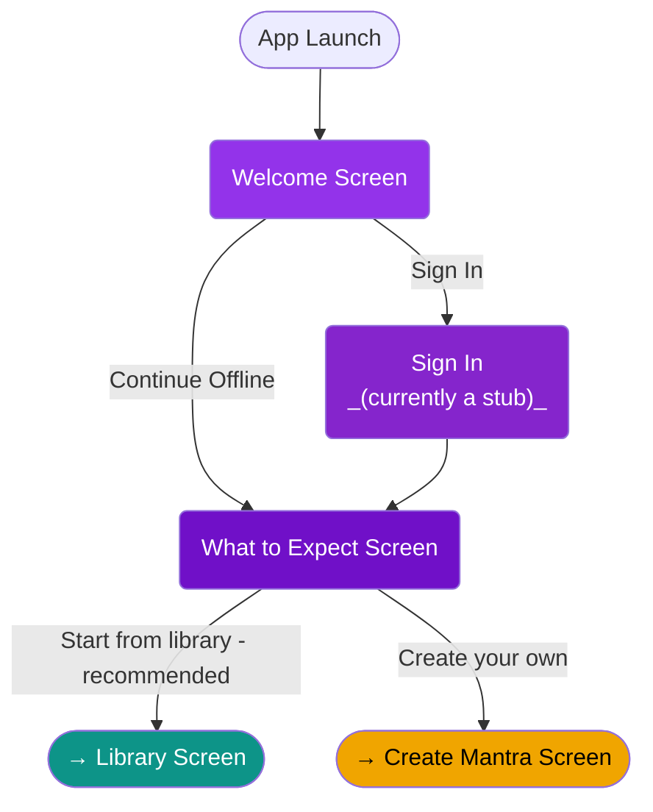

#### Screen 1: Welcome

- App logo with calligraphy styling
- Philosophy quote: *"Abhyasa Vairagyabhyam Tan-Nirodhah"* — by practice and non-attachment the mind is still (Yoga Sutras 1.12)
- Language selector icon
  - On mobile: defaults to system language
  - On other platforms (or as fallback): English
- Two actions:
  - **Sign In** (stub — full auth is Phase 2.0)
  - **Continue Offline**
- Note at bottom: "You will always be able to change this selection later in Settings"

#### Screen 1a: Sign in
- Currently a stub, as sign-in is a future phase
- Three stub buttons: Continue with Google, Continue with Apple, Sign in with Email
- All buttons show a "Coming soon" message and proceed to the Expectations screen

#### Screen 1b: What to Expect

Introductory copy:

> Developing the habit of Practicing Mantra, one step at a time.
>
> This app was made to help you improve your life through practicing the ancient traditions of Mantras.
>
> You will be able to:
> - Practice traditional Mantras
> - Get reminders on when to practice
> - Count your practice at your own pace, or listen to the mantra on your way to work
> - Create your personal mantras, goals and habits
> - Get motivated, empowered, healthier and happier

Followed by a choice:

- **"Start with a mantra from our library"** (recommended) — continues to Flow 3 (Library)
- **"Create your own"** — continues to Flow 4 (Create Mantra)

#### Screen 3a: Library (first mantra selection)

- Library screen opens with the **"Popular"** tag pre-selected as a search filter
- The filter selection should be clearly visible and easy to remove, so the user understands they can browse freely
- User picks a mantra → continues through Flow 3 → lands on MyPractice

#### Screen 3b: Create Mantra

- Standard Create Mantra screen (see Flow 4)
- User fills in their mantra and saves → proceeds to Practice Plan → lands on MyPractice

#### Language model

Every mantra has three textual layers for the user:

1. **Original form** — in the original script (e.g., Devanagari, Tibetan, Hebrew)
2. **Transliteration** — in Latin characters, as a pronunciation guide for users who cannot read the original script
3. **Translation** — in the user's selected UI language

---

### Flow 2: Practicing a Mantra

The core loop. User taps a mantra on the MyPractice screen and enters an immersive practice session.

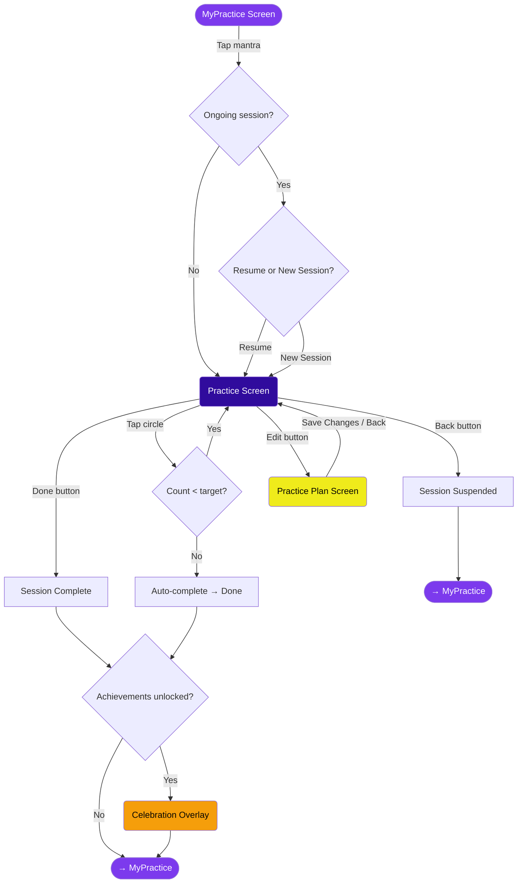

#### Entry (from MyPractice screen)

- User taps a mantra card
- **If the mantra has an ongoing (suspended) session:** prompt with two options — "Resume" or "New Session"
- **If no ongoing session:** go straight to the Practice Screen

#### Practice Screen layout

- **Center:** large circle — counter display + progress indicator
- **Bottom:** **Done** button — bold, in the theme's primary color
- **Top-left:** **Back** — small icon + text, muted color
- **Top-right:** **Edit** — small icon + text, muted color

No timer. Timing practice is counter to the app's philosophy of non-attachment.

#### Practice modes

Practice mode is a **per-mantra setting**, configured when the mantra is added to MyPractice (not a per-session choice):

1. **Tap to count** — user says the mantra and taps the circle to count each repetition (available now)
2. **Listen** — user listens to the mantra audio (future)
3. **AI listens** — user says the mantra, AI detects and counts repetitions (future)

#### Exit paths

- **Done** — session marked complete regardless of whether the target rep count was reached. Progress is saved, streaks updated, achievement checks run. Celebration overlay shown if new achievements are unlocked.
- **Back** — session suspended at the current rep count. The session remains open and resumable. User returns to MyPractice.
- **Auto-complete** — when reps reach the target, behaves the same as Done.
- **Edit** — opens the Practice Plan screen (edit mode). Returns to Practice Screen when done.

#### Session model

- Each mantra independently tracks its own open session (if any)
- Multiple mantras can have open sessions simultaneously — no inter-relations
- Every session is either ongoing or complete — there is no discard

#### Reaching the Practice Plan screen

The Practice Plan screen is **not** part of the normal practice flow. It is reached only via:

- **A.** Adding a mantra from the library (Flow 3) — Library card tap → Practice Plan (add-from-library mode)
- **B.** Creating a new mantra (Flow 4) — Create Mantra form → Save → Practice Plan (post-create mode)
- **C.** Tapping "Edit" from within a practice session — Practice Plan (edit mode)

---

### Flow 3: Adding a Mantra from Library

User browses the built-in mantra library, selects a mantra, configures its settings, and adds it to their practice.

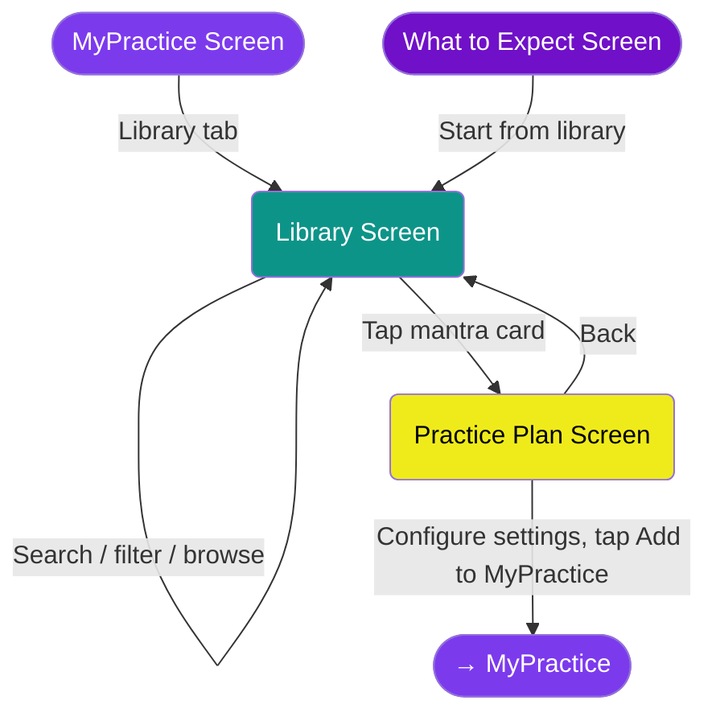

#### Library Screen

- Search bar: filter by title, short title, or tradition
- Category chips (horizontal scroll): e.g. All, Popular, Yogic Philosophy, Buddhist, etc.
- Mantra cards showing: signature badge, short title, source, difficulty, primary text, translation, tags

#### Practice Plan Screen

Reached after tapping a mantra card in the Library. This is the **same screen** used when editing an existing mantra (via "Edit" in a practice session), with context-dependent variations.

> **Note on screen terminology:** "Practice Plan" is a full screen in the library-add and post-create contexts, and also in the edit context (pushed over the Practice screen). The distinction between "screen" and "overlay" in this document is intentionally approximate — see individual screen YAMLs for precise layout type.

**Read-only details** (from the library entry):
- Original text (in original script)
- Transliteration
- Translation
- Traditions
- Benefits
- Difficulty
- Tags

**Configurable settings** (visually distinct — different color/button style):
- Target repetition count
- Count mode: Session / Daily / Weekly
- Practice mode: Tap to count / Listen (future) / AI listens (future)
- Reminders: add one or more (entirely optional)

**Actions:**
- **"Add to MyPractice"** (bottom of screen) — adds the mantra and navigates to MyPractice
- **Back** — returns to Library without adding (Android back button also works)

#### Settings inheritance

Configurable fields display the effective value with a subtle source label:

```
User explicit selection  →  User global defaults  →  Mantra's library recommendation
```

- Both levels default to "inherit," so unless the user changes anything, the library mantra's recommended values apply
- Fields show the effective value with a label indicating the source:
  - `108 (recommended)` — value comes from the library mantra
  - `108 (your default)` — value comes from user's global Settings
  - `108` (no label) — explicitly set by the user for this mantra
- The user can override at either level: globally in Settings, or per-mantra on this screen

---

### Flow 4: Creating a New Mantra

User creates a custom mantra from scratch and adds it to their practice.

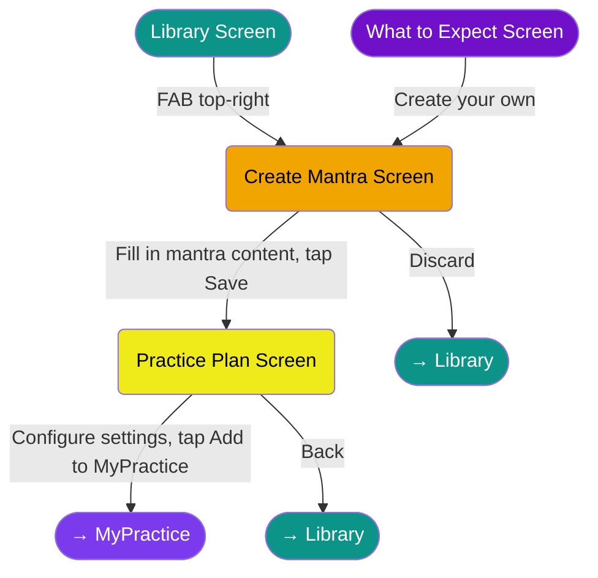

#### Entry points

- **Library screen** — floating action button (circle with **+** icon, no text) at the top-right
- **Onboarding** — "Create your own" option (see Flow 1)

Note: MyPractice has no FAB. All mantra addition (from library or custom) starts from the Library tab.

#### Create Mantra Screen (2b)

This screen handles **content entry only**. The user fills in the mantra's textual fields, then taps Save to proceed to the Practice Plan screen to configure practice settings.

**User-entered fields:**
- Title (required)
- Mantra text (required) — in original script
- Transliteration (optional)
- Translation (optional)
- Tradition (optional)

**Actions:**
- **"Save"** — saves the mantra draft and navigates to the Practice Plan screen (post-create mode)
- **"Discard"** — discards without saving and returns to Library

#### Practice Plan Screen (post-create mode)

Same screen as Flow 3 (adding from library), but the mantra fields are pre-filled from the just-created mantra (and there are no library recommendations to inherit).

#### Settings inheritance (post-create mode)

Since there is no library recommendation for a custom mantra, the inheritance chain is shorter:

```
User explicit selection  →  User global defaults
```

Fields show the effective value with a label: `108 (your default)` or `108` (no label) if explicitly set.

#### Future enhancement

AI-guided mantra creation — a conversational service that helps users discover or compose a personal mantra based on their intentions and needs. Paid option due to API costs. See Phase 4.0 (Guru-Guided Mantra Creation) in features.md.

---
### Flow 5: MyPractice Screen

The main hub. Shows all mantras the user has added to their practice. This is the center of the app.

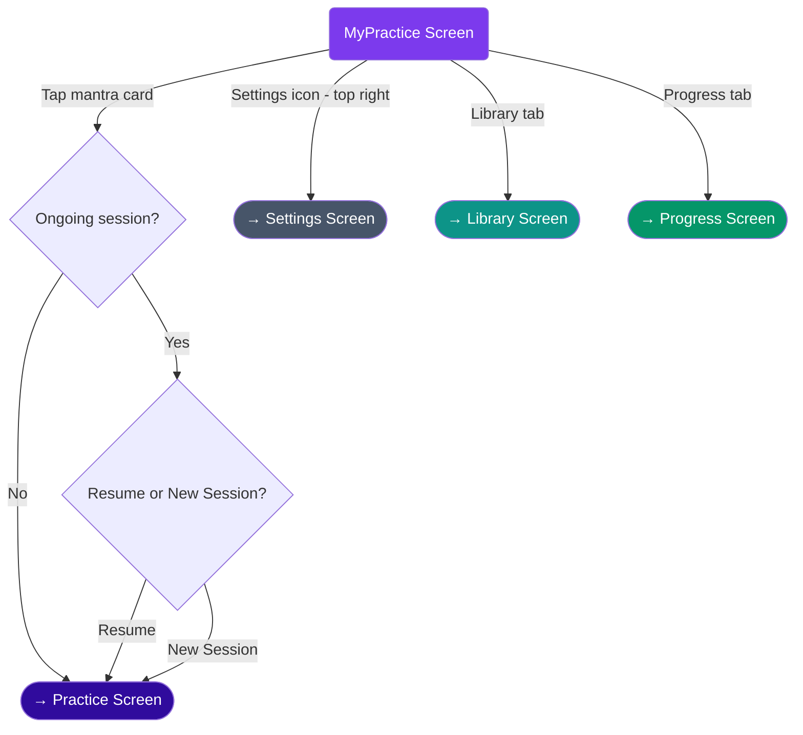

#### Navigation structure

3-tab bottom navigation:

| Position | Tab | Size |
|----------|-----|------|
| Left | Library | Small |
| Center | MyPractice | Big (dominant) |
| Right | Progress | Small |

- **Settings** — small gear icon, top-right corner, visible only on MyPractice screen. Navigates to a full Settings screen.
- No search bar. No FAB. Adding mantras happens via the Library tab.

#### Mantra cards

Cards are displayed in the order the user added them. Each card shows:

- **Title in original script** — large, prominent
- **Title in user's language** — smaller, faded shade
- **Dynamic badge** — one of three states:
  - **Idle** — prayer icon (invites user to start a session)
  - **Ongoing** — mini-ring showing suspended session progress (same visual language as the big practice ring, card-sized)
  - **Streak** — weightlifting/energy icon (encourages continuation). Hidden if a session is ongoing.

#### Empty state

Shown when the user has no mantras in MyPractice:

> "No Mantras to practice yet. To Start — select one from Library or Create your own."

#### Mantra limit warning

No hard limit on the number of mantras. However, when the user attempts to add a 6th mantra, a soft warning is shown:

> "Note: are you sure? Practicing more than 5 mantras may dilute your focus."

Dismissible — user can proceed if they choose.

---


### Flow 6: Achievement Screen (Progress Tab)

A quiet, display-only screen showing the user's overall practice stats and earned achievements. Intentionally understated — aligned with the app's philosophy of non-attachment.

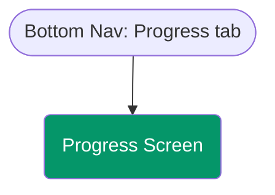

#### Stats summary

Aggregate totals across all mantras:

- **Current streak** (days)
- **Longest streak** (days)
- **Total sessions**
- **Total repetitions** (formatted: 1.2K, 50K, 1M, etc.)
- **Member since** (date)

#### Achievement gallery

2-column grid. Display only — tapping does nothing.

**Progressive visibility:**
- **Unlocked** — full color, icon, title, description, rarity badge
- **Locked teaser** (next in chain after an unlocked achievement) — greyed out, lock icon, title visible
- **Hidden** (further down the chain) — not rendered at all

**Rarity tiers (10 levels):**
Common, Uncommon, Rare, Super Rare, Epic, Heroic, Exotic, Mythic, Legendary, Divine

- Higher rarities (Exotic+) use animated gradient text
- Divine tier has rainbow animation

**Achievement categories (40+):**
- Streak: 1, 3, 7, 14, 30, 60, 90, 180, 365, 1095 days
- Repetitions: 1K, 5K, 10K, 50K, 100K, 250K, 500K, 1M
- Sessions: 10, 100, 250, 500, 1K, 2K, 10K, 50K, 100K
- Time of day: Early Bird (4-7 AM), Night Owl (after 10 PM)
- Platform: Android, iOS, macOS, Linux, Web
- Special: Creator (first custom mantra)

---

### Flow 7: Editing a Mantra

User modifies an existing mantra's settings from within a practice session.

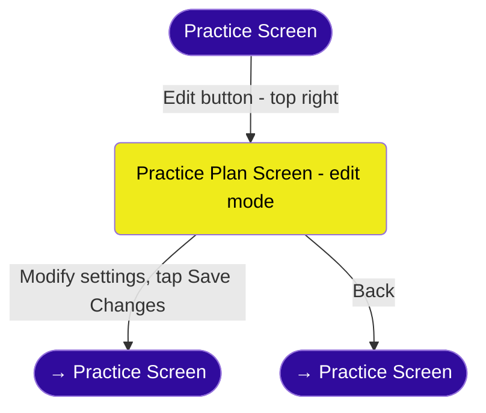

#### Entry point

- **Practice Screen** — "Edit" button (top-right, small icon + text, muted color)
- This is the only way to reach the edit flow. There is no edit option from MyPractice directly.

#### Practice Plan Screen (edit mode)

Same screen as Flow 3 (adding from library) and Flow 4 (post-create), but with all settings pre-filled with the mantra's current values. Mantra textual fields (original text, transliteration, translation) are displayed read-only.

**Configurable settings:**
- Target repetition count
- Count mode: Session / Daily / Weekly
- Practice mode: Tap to count / Listen (future) / AI listens (future)
- Reminders: add, edit, or remove

**Actions:**
- **"Save Changes"** (bottom of screen) — saves modifications and returns to Practice Screen
- **"Delete Mantra"** — red button at the bottom of the list, below Save Changes (see Flow 8)
- **Back** — returns to Practice Screen without saving

#### Settings inheritance (edit mode)

Same chain as Flow 3:

```
User explicit selection  →  User global defaults  →  Mantra's library recommendation
```

- If the user previously overrode a value, it shows without a label
- If a value is still inherited, the source label is shown: `(recommended)` or `(your default)`
- For custom-created mantras (no library source), the chain is: `User explicit selection → User global defaults`

---

### Flow 8: Deleting a Mantra

User removes a mantra from their practice. This action is only available from the Practice Plan screen in edit mode.

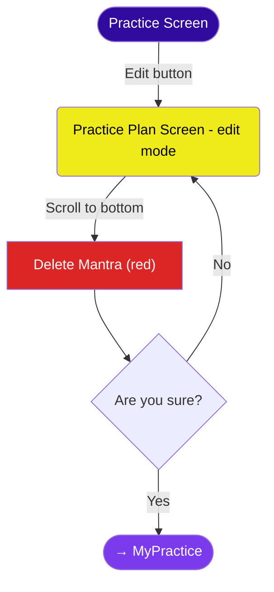

#### Entry point

- **Practice Plan screen (edit mode)** — "Delete Mantra" button at the very bottom of the screen, styled in red to signal destructive action

#### Flow

1. User is in the Practice Plan screen (edit mode), reached via "Edit" on the Practice Screen
2. Scrolls to the bottom of the settings list
3. Taps "Delete Mantra" (red button)
4. Confirmation dialog: "Are you sure? This will remove the mantra and all its session history from your practice."
5. **Yes** — mantra is deleted along with all its sessions, reminders, and progress. User is returned to MyPractice.
6. **No** — dialog dismissed, user stays on the Practice Plan screen

#### Notes

- Delete is intentionally buried at the bottom of the edit screen to prevent accidental taps
- There is no undo — deletion is permanent
- Deletion cascade: mantra, all associated sessions, all reminders
- Aggregate stats (total reps, total sessions) in Progress are **not** reduced — they represent lifetime totals

---

### Flow 9: Settings

App configuration. Reached via the gear icon on the top-right of the MyPractice screen (only visible there).

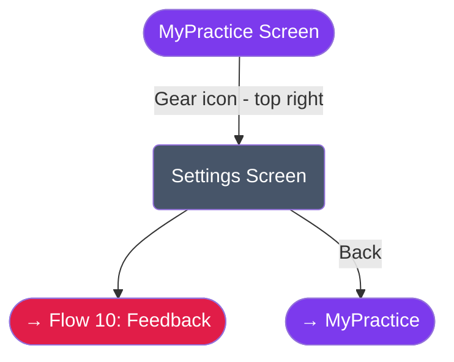

#### Entry point

- **MyPractice screen** — small gear icon, top-right corner. Not visible on other screens.

#### Sections

**Account**
- Current status: "Offline mode"
- Note: "Sign in to sync your data across devices (coming soon)"
- Sign In button (stub — full auth is Phase 2.0)
- Future sign-in reasons: (1) data sync / backup across devices, (2) paid AI mantra creation service (may be offloaded to a web service instead)

**Language**
- UI language selector (same control as the welcome screen)
- Affects UI text and mantra translations
- Note at top: same as welcome screen — "You will always be able to change this selection later in Settings" is fulfilled here

**Appearance**
- Theme: Dark / Light / System
- Font size: Small / Medium / Large (persisted but not yet applied — planned for implementation with at least 3 size options)

**Practice Defaults**
- Default repetitions: 27 / 54 / 108 / 216
- Default cycle: Session / Daily / Weekly
- Default practice mode: Tap to count / Listen (future) / AI listens (future)
- Haptic feedback: toggle
- Limit tap rate: toggle ("Prevents double-counts, 1s minimum")

These defaults feed the settings inheritance chain (see Flow 3). Shown as `(your default)` on the Practice Plan screen when not explicitly overridden.

**Notifications**
- Enable notifications: master toggle

**About**
- App name
- Version
- Philosophy quote: *"Abhyasa Vairagyabhyam Tan-Nirodhah"* — by practice and non-attachment the mind is still (Yoga Sutras 1.12)

**Feedback** (bottom of screen)
- Button → opens Flow 10 (User Feedback)

#### Behavior

- All changes are saved immediately — no "Save" button needed
- Back navigates to MyPractice

---


### Flow 10: User Feedback

Accessible from the Settings screen. User selects a feedback category and sends an email.

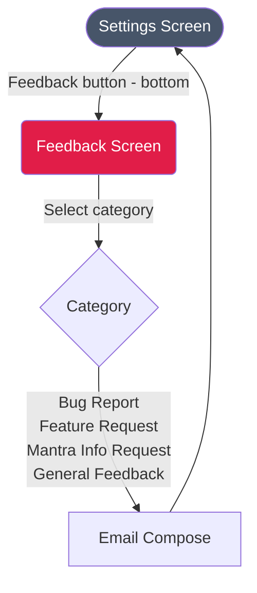

#### Entry point

- **Settings screen** — "Feedback" button at the bottom

#### Feedback Screen

User selects one of four categories:

1. **Bug Report** — something is broken
2. **Feature Request** — suggest a new feature or improvement
3. **Mantra Info Request** — request a correction or addition to library mantra content
4. **General Feedback** — anything else

After selecting a category, the device's email compose opens with:
- **To:** pre-filled app support email address
- **Subject:** pre-filled with the selected category (e.g., "[MyMantra] Bug Report")
- **Body:** pre-filled with app version, platform, and OS for context. User writes their message above.

No PII collected automatically — just technical context to help triage.

#### Future enhancement

Wire incoming feedback emails to GitHub issues automatically (email-to-issue pipeline). Backend implementation deferred.

---

## Screen Navigation Map

Every screen in the app and how they connect.

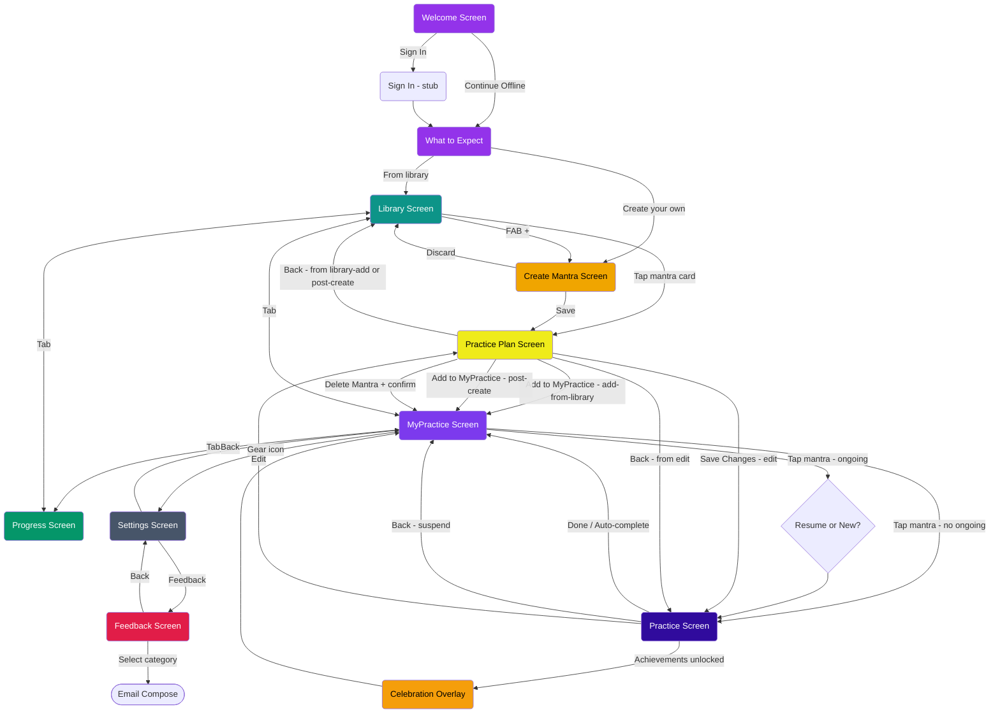
---

## 2. Screens Details

### List of Screens

> **Screen vs. overlay terminology:** Some entries below are full screens (own route, full-screen layout) while others are overlays (rendered on top of the current screen). The individual screen YAML files are the authoritative source for layout type. This table does not distinguish them precisely, by design.

|id|screen-name    |function                    |navigation/action-buttons     |
|--|---------------|----------------------------|------------------------------|
|1 |Welcome        |philosophy intro             |sign-in / continue-offline    |
|1a|Sign In        |third-party/email sign in   |sign-in (stub)                |
|1b|Expectations   |engage the user with app    |library / create              |
|2 |Library        |browse and select mantras from the built-in collection |add-mantra / create /<br/>progress / MyPractice|
|2b|Create Mantra  |enter mantra content (text, transliteration, translation, tradition) |[fields] / save / discard|
|3 |Practice Plan  |configure how to practice a mantra (target reps, cycle, mode, reminders); context-aware: add-from-library / post-create / edit |[settings] / save /<br/>cancel / delete|
|3b|Delete Mantra  |confirm mantra deletion (overlay) |delete / cancel     |
|4 |MyPractice     |list of mantras to practice |practice / library / progress / settings|
|5 |Progress       |show metrics and badges     |library / MyPractice          |
|6 |User Settings  |set user settings           |save / discard                |
|6b|User Feedback  |user sends feedback         |send / cancel                 |
|7 |Practice       |the main practice screen    |tap-circle / edit / done / back|
|7b|Celebration    |celebrate achievement unlock|tap-anywhere / auto-dismiss   |

YAML files are used to describe the UI elements of every screen.
The idea is to document the expected type, shape, location etc. of most UI,
so we get Product, Software and test - all aligned on what to expect and execute.
**Note** This is not a full capture of any detail of the widget appearance
         nor to define the exact behavior of each widget.

### 2.1 Welcome
First screen on app launch. Logo, philosophy quote, language selector, and two entry paths: Sign In or Continue Offline.
→ [screens/welcome.yaml](screens/welcome.yaml)

### 2.1a Sign In
Third-party and email authentication. Currently a stub — full implementation in Phase 2.0.
→ [screens/sign_in.yaml](screens/sign_in.yaml)

### 2.1b Expectations
Introduces the app's purpose and capabilities. Ends with a choice: start from the library or create your own mantra.
→ [screens/expectations.yaml](screens/expectations.yaml)

### 2.2 Library
Browse the built-in mantra collection. Search, filter by category, tap a card to configure and add. FAB to create a custom mantra.
→ [screens/library.yaml](screens/library.yaml)

### 2.2b Create Mantra
Content entry for a personal mantra: original text, transliteration, translation, tradition. On Save, proceeds to the Practice Plan screen (post-create mode) to configure settings.
→ [screens/create_mantra.yaml](screens/create_mantra.yaml)

### 2.3 Practice Plan
Configure how to practice a mantra: target reps, cycle, mode, reminders. Context-aware: used for library-add, post-create, and edit scenarios. Includes the Delete Mantra action (edit context only).
→ [screens/practice_plan.yaml](screens/practice_plan.yaml)

### 2.3b Delete Mantra
Confirmation overlay triggered from Practice Plan. Warns that deletion is permanent and cascades to sessions, reminders, and progress.
→ [screens/delete_mantra.yaml](screens/delete_mantra.yaml)

### 2.4 MyPractice
The app's main hub. Shows all mantras the user is practicing, with dynamic badges for idle, ongoing, and streak states.
→ [screens/mypractice.yaml](screens/mypractice.yaml)

### 2.5 Progress
Aggregate practice stats and achievement gallery. Display only — intentionally understated, aligned with non-attachment philosophy.
→ [screens/progress.yaml](screens/progress.yaml)

### 2.6 User Settings
App-wide configuration: account, language, appearance, practice defaults, notifications. All changes saved immediately.
→ [screens/user_settings.yaml](screens/user_settings.yaml)

### 2.6b User Feedback
Pick a category (bug, feature request, mantra info, general), then compose an email with pre-filled context.
→ [screens/user_feedback.yaml](screens/user_feedback.yaml)

### 2.7 Practice
The immersive practice screen. Large tap circle, counter, Done/Back/Edit. No timer. No distractions.
→ [screens/practice.yaml](screens/practice.yaml)

### 2.7b Celebration
Achievement unlock overlay. Shown after session completion when new achievements are earned. Tap-anywhere or auto-dismisses after a few seconds.
→ [screens/celebration.yaml](screens/celebration.yaml)


## 3. Change Log

| Version | Date | Changes |
|---------|------|---------|
| 0.1 | 2025-11 | Initial draft — auth, plans, voice playback flows |
| 0.2 | 2026-03-16 | Complete rewrite — 9 flows defined from product discussions |
| 0.3 | 2026-03-17 | Clarify two-screen flow: Create Mantra (2b) → Practice Plan (3); rename "Mantra Settings Screen" throughout to "Practice Plan Screen" / "Create Mantra Screen"; add "e.g." to library category list; add screen-vs-overlay terminology note; update screen navigation map; fix Flow 9 Feedback reference (Flow 10, not 8) |
