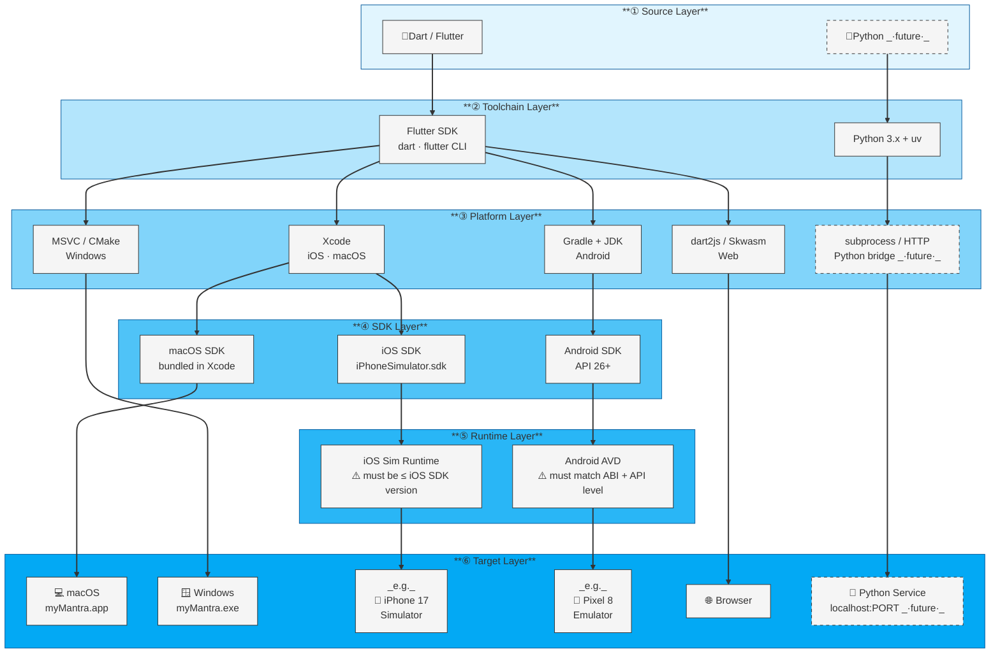
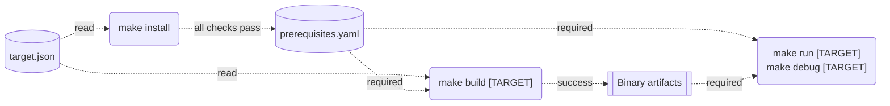
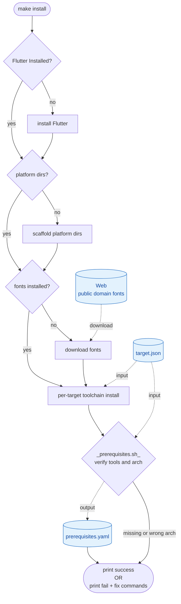
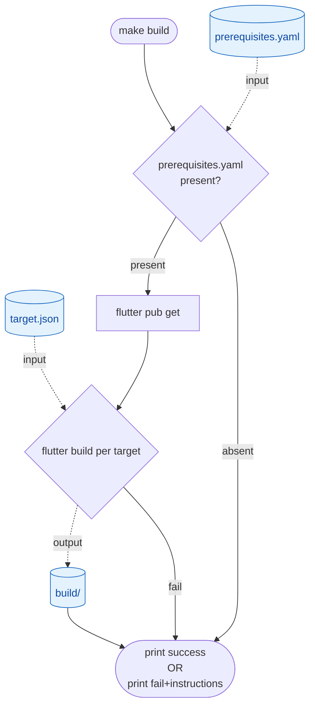

# Build System Architecture
## myMantra — Platform Build & Runtime Design

**Version:** 1.0
**Date:** March 2026
**Status:** Active

---

## 1. Targets

There are currently five targets:
1. Mobile
  a. iOS
  b. Android
2. Web
3. MacOS
4. Windows

in the future other targets may be added

## 2. Developer tools & environment:

### Languages for UI and Application logic:
- Flutter
  - dart
### For Agentic services:
- Python
  - litellm
### installation and build:
- Makefile
  - bash
- CI/CD
  - Docker
  - Jenkins
### IDE Support:
- VS Code

## 2. Platform Architecture

The system supports four immediate build targets and one planned target (Python agentic service).
Each target has a distinct toolchain and runtime stack. The diagram below shows all layers
from source code to running process.



---

## 3. Toolchain Resolution Stages

### Command reference

| Command | Behavior |
|---|---|
| `make install` | Installs tools and verifies environment for all `build:true` targets |
| `make install TARGET=ios` | Only for the specified target |
| `make build` | Builds release artifacts for all `build:true` targets |
| `make build TARGET=web` | Only for the specified target |
| `make run` | Runs the app — only when exactly one `build:true` target is active |
| `make run TARGET=ios` | Required when multiple `build:true` targets are active |
| `make debug` | Runs with hot reload — only when exactly one `debug:true` target is active |
| `make debug TARGET=ios` | Required when multiple `debug:true` targets are active |
| `make clean` | Removes all build artifacts |

### Dependency and gate model

`make/prerequisites.yaml` is written by `make install` on success. `make build`, `make run`, and `make debug` abort immediately if it is absent — run `make install` first.



### `target.json` — configuration source

All commands read `target.json` at the project root. To activate or deactivate a target, edit the file — no Makefile changes needed.

```json
{
    "ios":     { "target": "iPhone 17",    "version": "26.3", "build": true,  "debug": true  },
    "android": { "target": "Pixel_10_Pro", "version": "16.0", "build": false, "debug": true  },
    "macos":   {                                               "build": true,  "debug": true  },
    "web":     {                                               "build": true,  "debug": false },
    "windows": {                                               "build": false, "debug": false }
}
```

| Field | Required for | Default | Meaning |
|---|---|---|---|
| `target` | `ios`, `android` | — | Device or simulator name; passed as `flutter run -d <value>`; unused for `macos`, `web`, and `windows` |
| `version` | — | — | Informational; minimum OS version |
| `build` | — | `true` | Include in `make install` and `make build` |
| `debug` | — | `true` | Include in `make debug`; compile with debug symbols and assertions |

---

### Stage 1 — Install (`make install`)

**Trigger:** Once per machine. Re-run after adding a target, updating Xcode, or changing tools.

`make install` reads `target.json`, determines the active targets, installs the required toolchain per target, downloads fonts, then calls `make/prerequisites.sh` to verify the environment. On success, `make/prerequisites.yaml` is written.

**Scripts involved:**

| Script | Role | Inputs | Outputs |
|---|---|---|---|
| `make/install.sh` | Installs all toolchain components; calls `prerequisites.sh` at the end | `target.json`, `--target <name>` | Installed toolchain and fonts |
| `make/lib.sh` | Shared utilities; sourced by all scripts | — | Shell variables (`REPO_ROOT`, `FLUTTER`, `FONTS_DIR`); functions `resolve_build_targets()`, `resolve_run_target()` |
| `make/prerequisites.sh` | **Verification only — does not install anything.** Checks that all required tools are present and arm64 after installation is complete. | `--targets <comma-list>` | `make/prerequisites.yaml` on success; exit 1 with the name of the failing tool and its install command |

**Target-aware verification:** `prerequisites.sh` receives the active target list via `--targets`. Platform checks (`ios-sim`, `android-avd`) are hard failures only for active targets; they appear as warnings for inactive ones. If a check fails, the fix is to install the missing tool and re-run `make install` — not to run `prerequisites.sh` directly.

**Per-target install steps:**

| Target | Steps |
|---|---|
| `ios` | Flutter SDK · iOS simulator runtime via xcodes + aria2 · CocoaPods · `pod install` |
| `macos` | Flutter SDK · CocoaPods · `pod install` |
| `android` | Checks Android Studio and SDK at expected path; prints install URL if absent |
| `web` | Flutter SDK; no additional tooling |
| `windows` | Flutter SDK; Visual Studio Build Tools with C++ desktop workload (installed by Visual Studio or standalone) |
| all targets | Platform scaffold (`flutter create`) if platform dirs are absent · fonts (~35 MB, idempotent per file) |



---

### Stage 2 — Build (`make build`)

**Trigger:** When a distributable artifact is needed — CI pipeline, app store submission, QA build.

`make build` checks for `make/prerequisites.yaml`, reads `target.json` to determine the active targets, runs `flutter pub get` once, then compiles each target. The `debug` field in `target.json` controls whether each artifact is built with `--debug` or `--release`.

**Per-target build:**

| Target | Flutter command | Artifact |
|---|---|---|
| `ios` | `flutter build ios` | `.app` bundle |
| `android` | `flutter build appbundle` | Android App Bundle (`.aab`) — the format required by Play Store |
| `macos` | `flutter build macos` | `.app` bundle |
| `windows` | `flutter build windows` | `.exe` in `build/windows/x64/runner/Release/` |
| `web` | `flutter build web` | Static files in `build/web/` |



---

### Stage 3 — Run / Debug (`make run` · `make debug`)

**Trigger:** Local development — launching the app for testing or active development.

Both commands require `make/prerequisites.yaml`. Flutter handles compilation internally: if no current build artifact exists it will compile before launching, so an explicit `make build` beforehand is not required.

**`make run`** launches in release mode (no hot reload); selects from targets where `build: true`.
**`make debug`** launches with hot reload and debug tooling; selects from targets where `debug: true`.

In both cases: if exactly one target qualifies it is selected automatically. If more than one qualifies, `TARGET=<name>` is required and the command prints the available options.

**Device selection per platform:**

| Target | Device argument |
|---|---|
| `ios` | Value of the `target` field in `target.json`, passed as `flutter run -d <value>` |
| `android` | Running emulator ID; `run.sh` boots the AVD named in `target.json` if no emulator is running, then waits for full boot before launching |
| `macos` | Always `-d macos` |
| `windows` | Always `-d windows` |
| `web` | Always `-d chrome`; the `target` field is not used |

---

## 4. Compatibility Constraints by Target

The table below covers the most common known constraints. Constraints enforced internally by Xcode, Gradle, and Flutter are not listed — this is not an exhaustive reference.

| Target | Constraint | Detected / Enforced by |
|---|---|---|
| iOS Simulator | Runtime version ≤ Xcode SDK version | `make install` — `prerequisites.sh` explicit check |
| iOS Simulator | Deployment target ≤ Runtime version | Xcode at build time |
| Android Emulator | JDK compatible with Gradle version | `make install` — `prerequisites.sh` |
| Android Emulator | AVD API level ≤ installed Android SDK | `make install` — `prerequisites.sh` |
| macOS | macOS version ≥ deployment target | Xcode at build time |
| Web | No simulator or runtime constraints | N/A |
| Windows | Visual Studio Build Tools with C++ desktop workload | `make install` — `prerequisites.sh` (when on Windows) |
| Python service _(future)_ | Python version ≥ `requires-python` in `pyproject.toml` | `make install` — to be added |

---

## 5. Stage Responsibility Reference

When adding new logic to the build system, apply these rules to determine where it belongs.

**Belongs in `make install` if:**
- It installs or verifies a tool, SDK, runtime, or environment asset
- A missing or misconfigured dependency would produce a cryptic error inside Xcode, Gradle, or the Flutter toolchain
- It is idempotent — safe to skip when already satisfied, and cheap to check
- It must be complete before any build or run can succeed

**Belongs in `make build` if:**
- It depends on the current state of source code, `pubspec.yaml`, or `Podfile`
- It produces a compiled artifact — binary, bundle, or static output
- It must re-run whenever the code changes
- It is owned or coordinated by a build tool (Xcode, Gradle, dart2js)

**Belongs in `make run` / `make debug` if:**
- It depends on which device, simulator, or browser is currently available
- It requires negotiation between toolchain layers (Flutter CLI, xcodebuild, ADB)
- It changes based on runtime state rather than source state
- Hard-coding it in a script would couple the build system to state it cannot reliably predict

**Examples:**

| Logic | Stage | Reason |
|---|---|---|
| Downloading fonts | `install` | Network-dependent; needed once; idempotent per file |
| iOS simulator runtime install | `install` | Static env requirement; missing runtime causes cryptic xcodebuild failure |
| `flutter pub get` | `build` | Depends on `pubspec.yaml`; must re-run when dependencies change |
| `pod install` | `install` (initial) | Depends on Flutter pub output; re-run via `make install` after adding native plugins |
| Code signing identity | `run`/`debug` | Xcode resolves the matching certificate from the keychain at build time |
| Which simulator to boot | `run`/`debug` | Flutter CLI queries eligible destinations dynamically; a script cannot replicate this reliably |
