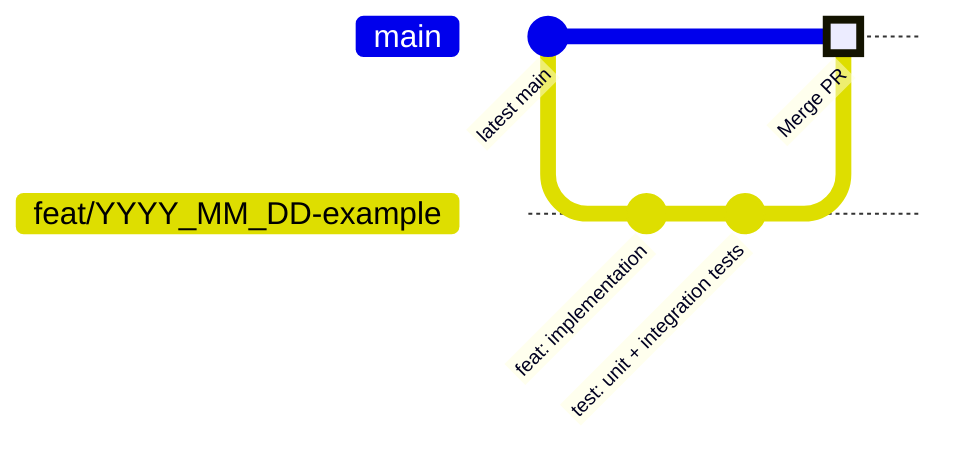
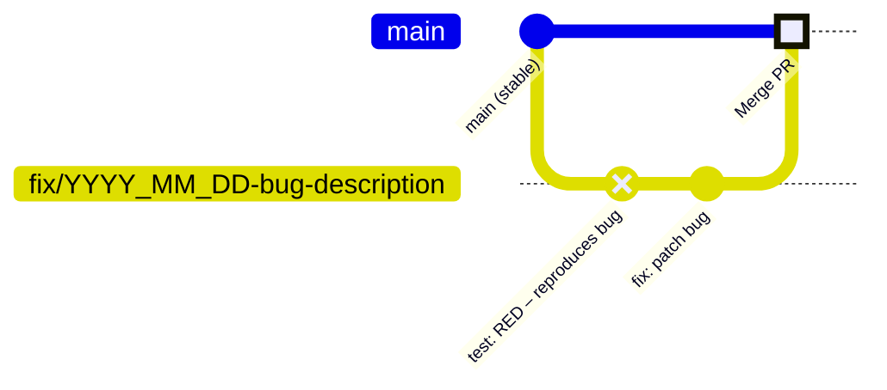
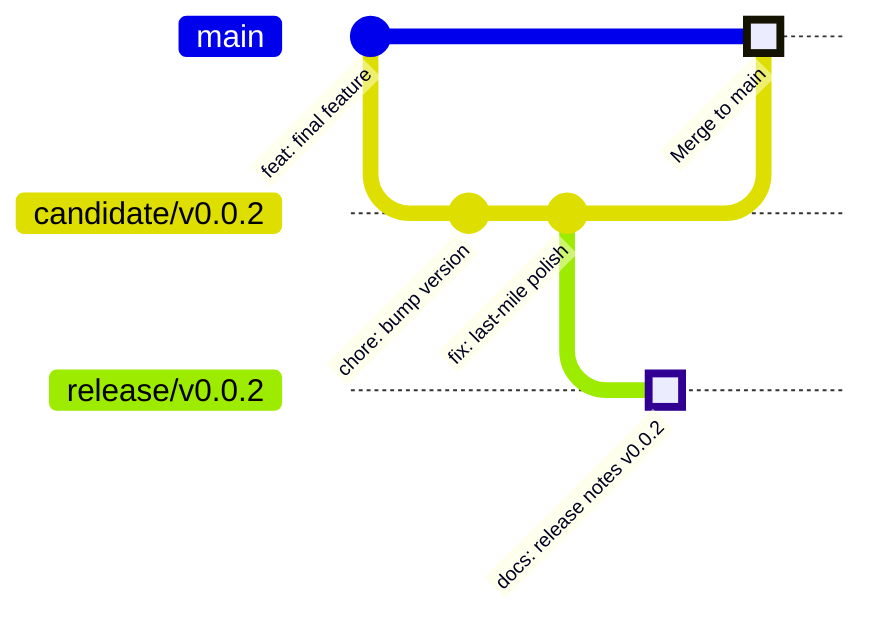
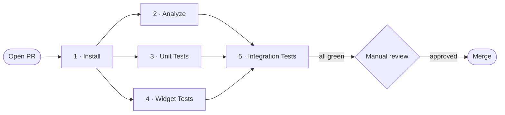

# Git Workflow
## MyMantra

**Version:** 0.6
**Date:** March 2026
**Status:** Active

---

## Table of Contents

1. [Overview](#1-overview)
2. [Branch Strategy](#2-branch-strategy)
   - 2.1 [Permanent Branches](#21-permanent-branches)
   - 2.2 [Working Branches](#22-working-branches)
   - 2.3 [Naming Convention](#23-naming-convention)
3. [Commit Messages](#3-commit-messages)
4. [Workflow Flows](#4-workflow-flows)
   - 4.1 [Feature Flow](#41-feature-flow)
   - 4.2 [Bug Fix Flow](#42-bug-fix-flow)
   - 4.3 [Release Flow](#43-release-flow)
5. [Merge Gate](#5-merge-gate)
6. [Versioning (SemVer)](#6-versioning-semver)
7. [Stale Branch Policy](#7-stale-branch-policy)
8. [Testing Discipline](#8-testing-discipline)

---

## 1. Overview

MyMantra uses a **trunk-based** workflow with short-lived working branches. All production code lives on `main`; every change flows through a pull request (PR) guarded by CI.

No long-lived `develop` or `staging` branches are used. All integration happens directly on `main` via PR.

---

## 2. Branch Strategy

### 2.1 Permanent Branches

| Branch | Role | Direct push |
|--------|------|-------------|
| `main` | Production-ready, always releasable | ❌ Never |
| `candidate/vMAJOR.MINOR.BUGFIX` | Release stabilisation; branches from `main` | ❌ Never |
| `release/vMAJOR.MINOR.BUGFIX` | Frozen release archive; never modified after creation | ❌ After creation |

Examples: `candidate/v0.0.2`, `release/v0.0.2`  
The version segment matches the SemVer tag (see [§6 Versioning](#6-versioning-semver)).

### 2.2 Working Branches

| Prefix | Purpose | Example |
|--------|---------|---------|
| `feat/` | New user-facing feature | `feat/2026_03_13-app_icon_lotus` |
| `fix/` | Bug fix | `fix/2026_03_14-bug-004-render-emoji-ios` |
| `refactor/` | Internal restructure (no behaviour change) | `refactor/2026_03_13-add-macos-install-steps` |
| `test/` | Test additions or updates | `test/2026_03_07-add-test-suite` |
| `docs/` | Documentation only | `docs/2026_03_15-catalog-and-gitflow` |
| `chore/` | Dependency bump, toolchain update | `chore/2026_03_01-bump-flutter-stable` |
| `ci/` | CI/CD pipeline changes | `ci/2026_03_07-parallel-jobs` |

### 2.3 Naming Convention

```
<type>/YYYY_MM_DD-<short-description>
```

Rules:
- **type** — one of the prefixes above (lower-case)
- **YYYY_MM_DD** — ISO date the branch was created
- **short-description** — lowercase words separated by hyphens; no spaces

---

## 3. Commit Messages

Commits follow a simplified [Conventional Commits](https://www.conventionalcommits.org/) style:

```
<type>[optional scope]: <description>
```

| Type | When to use |
|------|-------------|
| `feat` | Introduces a new feature |
| `fix` | Patches a bug |
| `refactor` | Code change with no behaviour change |
| `test` | Adds or changes tests |
| `docs` | Documentation only |
| `chore` | Maintenance, dependency upgrade |
| `ci` | CI pipeline configuration |

Scope (optional) narrows the area of change — e.g. `fix(ci):`, `feat(session):`.

Examples:
```
feat: add repetition cycle picker to create/edit mantra screen
fix: BUG-001 back arrow no-op + BUG-002 Android hardware back bypass
refactor: restructure repo — lib/src/, platform dirs, cleanup
ci: run analyze, unit-test, widget-test in parallel after install
```

---

## 4. Workflow Flows

### 4.1 Feature Flow

Branch from `main`, develop in focused commits, then open a PR back to `main`. Implementation and tests must be in **separate commits**; the test commit must be reviewable on its own (see [§8 Testing Discipline](#8-testing-discipline)).



**Steps:** branch from latest `main` → implement in one or more commits → add test commit(s) → push → open PR → CI must pass → review → merge.

### 4.2 Bug Fix Flow

Bug fixes follow the same PR-gated flow but must apply the **Red → Green** idiom: the failing test is committed first (CI goes red), then the fix is committed (CI goes green). There is no bypass of the merge gate for urgent fixes; the `fix/` prefix signals urgency by convention.



**Steps:** branch from latest `main` → commit failing test (red) → commit fix (green) → push → open PR → CI must pass → review → merge.

### 4.3 Release Flow

A release candidate stabilises a set of merged features before they are archived as a formal release. Only critical fixes and version-bump commits are allowed on a `candidate` branch; no new features.



**Steps:**
1. Branch `candidate/vMAJOR.MINOR.BUGFIX` from `main`.
2. Stabilise — commit only critical fixes and version bumps; all changes go through PRs.
3. Branch `release/vMAJOR.MINOR.BUGFIX` from the candidate tip; add the release notes document (`docs/product/release_notes/vX.Y.Z.md`) as the final commit. This branch is now **frozen forever**.
4. Open a PR from `candidate` → `main`; CI must pass; merge and tag `main` with `ver-MAJOR.MINOR.BUGFIX`.

> `release/vMAJOR.MINOR.BUGFIX` branches are **never deleted** and **never modified** after the release notes commit. They serve as a permanent, auditable snapshot of what was shipped.

---

## 5. Merge Gate

Every change to `main` (or `candidate/vMAJOR.MINOR.BUGFIX`) must be submitted as a **Pull Request**. A PR may not be merged until:

1. **CI passes** — all five jobs are green (see below)
2. **Manual checks** pass:
   - PR description clearly states what changed and why
   - No unresolved review comments
   - Branch is not in draft / WIP state

### CI Jobs

Jobs run on GitHub Actions (`ubuntu-latest`).

| # | Job | What it runs |
|---|-----|--------------|
| 1 | **Install** | `make install TARGET=linux` — resolves deps, warms font & pub cache |
| 2 | **Analyze** | `flutter analyze` — zero warnings / errors policy |
| 3 | **Unit Tests** | `flutter test test/unit/ --coverage` |
| 4 | **Widget Tests** | `flutter test test/widget/` |
| 5 | **Integration Tests (Linux)** | `make test-integration TARGET=linux` (headless desktop) |

Jobs 2–4 run in parallel after job 1. Job 5 requires jobs 2–4 to succeed first.



---

## 6. Versioning (SemVer)

Releases are tagged on `main` using the form:

```
ver-<MAJOR>.<MINOR>.<PATCH>[-optional-label]
```

| Segment | Increment when |
|---------|----------------|
| **MAJOR** | Breaking change or major phase boundary (e.g., Phase 2.0 cloud sync) |
| **MINOR** | New user-facing feature shipped (e.g., reminder scheduling) |
| **PATCH** | Bug fix or non-functional improvement |

Example: `ver-0.0.1-✅-multiplatform` — first multiplatform release, pre-1.0.

Phase-to-version alignment:

| Phase | Version series |
|-------|---------------|
| Phase 1.0 (Offline MVP) | `ver-1.x.x` |
| Phase 2.0 (Cloud/Sync) | `ver-2.x.x` |
| Phase 3.0 (Gamification) | `ver-3.x.x` |

---

## 7. Stale Branch Policy

- Working branches are **kept** after their PR is merged. The `YYYY_MM_DD` date in the name provides a permanent audit trail of when the work was started.
- Branches untouched for **30+ days** without an open PR are considered stale and may be removed without notice.
- Force-push to `main` is **prohibited**.

---

## 8. Testing Discipline

### Features

Every feature branch must include one or more **dedicated test commit(s)** covering the new behaviour — unit tests and/or integration tests as appropriate. Tests must be committed separately from the implementation so the test intent is reviewable on its own.

```
feat: add repetition cycle picker          ← implementation
test: unit + widget tests for cycle picker ← separate test commit
```

### Bug Fixes — Red → Green

Every bug fix must follow the **Red → Green** idiom:

1. **Red commit** — add a test that reproduces the bug and **fails** on CI.
2. **Green commit** — apply the fix; the same test now passes.

```
test: RED – cycle picker crashes on 0 repetitions   ← fails CI
fix:  guard against zero in repetition cycle picker  ← test goes green
```

This ensures the test genuinely catches the regression and prevents the bug from silently reappearing.
