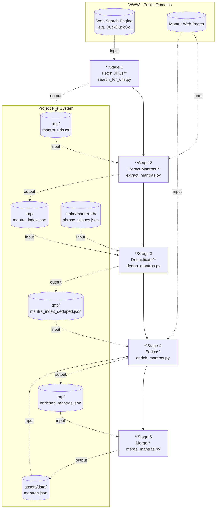

# Mantra DataBase Build

Five-stage pipeline for discovering, deduplicating, enriching, and merging
Mantras into the myMantra DataBase.

tool parameters are driven by `settings.yml` — no hardcoded values exist in the scripts.

---

## One-time migration — `consolidate_mantras.py`

Merges the legacy per-tradition JSON files (`assets/data/mantras/*.json`) into
the single versioned `assets/data/mantras.json` file.  Run this **once** after
pulling a repo that still has the old per-tradition layout:

```bash
python3 make/mantra-db/consolidate_mantras.py --dry-run   # preview
python3 make/mantra-db/consolidate_mantras.py             # write + delete old files
# or via Makefile:
make -f make/mantra-db/Makefile consolidate
```

After this step the `assets/data/mantras/` directory no longer exists; all
pipeline stages read from and write to `assets/data/mantras.json`.

---

## Pipeline overview



---

## `settings.yml` — single source of truth

Every tunable parameter lives here. Edit this file to change behaviour;
no script changes are needed.

| Stage | Section | Key | What it controls |
|---|---|---|---|
| — | `python.packages` | list | pip packages checked by `prerequisites` |
| — | `ollama.host` | URL | Ollama server hostname (default `http://localhost`) |
| — | `ollama.port` | int | Ollama server port (default `11434`) |
| 1 | `search_web.output` | path | URL list written by Stage 1 |
| 1 | `search_web.cities` | list of `{name, locale, mantra}` | cities and search terms for Stage 1 |
| 1 | `search_web.delay` | float (sec) | polite delay between WSE requests |
| 1 | `search_web.results_per_locale` | int | max URLs fetched per city |
| 1 | `search_web.cache_dir` | path | HTML cache directory |
| 2 | `extract_mantra.input` | path | URL list consumed by Stage 2 |
| 2 | `extract_mantra.output` | path | raw mantra index written by Stage 2 |
| 2 | `extract_mantra.llm_engines` | list | Ollama models used for extraction |
| 2 | `extract_mantra.delay` | float (sec) | polite delay between page fetches |
| 2 | `extract_mantra.max_page_chars` | int | page text truncation limit |
| 2 | `extract_mantra.cache_dir` | path | HTML cache directory (shared with Stage 1) |
| 3 | `dedup_mantras.input` | path | raw index consumed by Stage 3 |
| 3 | `dedup_mantras.output` | path | deduplicated index written by Stage 3 |
| 3 | `dedup_mantras.aliases` | filename | romanisation alias rules file |
| 4 | `enrich_mantras.input` | path | deduplicated index consumed by Stage 4 |
| 4 | `enrich_mantras.output` | path | enriched records written by Stage 4 |
| 4 | `enrich_mantras.llm_engines` | list | two models used for parallel drafts |
| 4 | `enrich_mantras.llm_combine` | string | model used to merge the two drafts |
| 4 | `enrich_mantras.max_source_chars` | int | source URL text truncation limit |
| 4 | `enrich_mantras.http_timeout` | int (sec) | HTTP timeout for source fetching |
| 5 | `merge_mantras.input` | path | enriched records consumed by Stage 5 |
| 5 | `merge_mantras.output` | path | final library file written by Stage 5 |
| 5 | `merge_mantras.min_abstract_chars` | int | minimum abstract length for new entries (default 300) |
| 5 | `merge_mantras.min_tags` | int | minimum tag count for new entries (default 3) |

All `input`/`output` paths are relative to the project root and resolved
to absolute paths at runtime via `settings.py`.

---

## Stage 1 — `search_for_urls.py`

Searches DuckDuckGo from main cities over the world
 using "mantra" in each local language and the country locale.
Collects ~10 URLs per locale, deduplicates across all locales, and writes
a flat URL list to `tmp/mantra_urls.txt`.

```bash
python3 make/mantra-db/search_for_urls.py               # search all locales
python3 make/mantra-db/search_for_urls.py --no-cache    # re-fetch (bypass cache)
python3 make/mantra-db/search_for_urls.py --verbose     # print each URL as found
python3 make/mantra-db/search_for_urls.py --output path/to/urls.txt
```

Output: `tmp/mantra_urls.txt` — one URL per line, ~100–180 unique URLs.

---

## Stage 2 — `extract_mantras.py`

Reads `tmp/mantra_urls.txt`, fetches each page with curl, and asks a local
Ollama LLM to extract every mantra phrase with its language and tags.
Results are appended to `mantra_index.json`. Duplicates are intentional
at this stage — curation happens in Stage 3.

**Requires:**
```bash
pip install litellm
ollama pull qwen2.5:32b
```

```bash
python3 make/mantra-db/extract_mantras.py                        # process all URLs
python3 make/mantra-db/extract_mantras.py --limit 5 --verbose   # quick test
python3 make/mantra-db/extract_mantras.py --model ollama/gemma3:27b
python3 make/mantra-db/extract_mantras.py --input path/to/urls.txt
```

Output: `tmp/mantra_index.json` — flat JSON array, one record per
extracted mantra:

```json
{
  "phrase":       "Om Namah Shivaya",
  "language":     "Sanskrit",
  "tags":         ["devotion", "hindu", "popular", "shiva"],
  "source_url":   "https://example.com/hindu-mantras",
  "source_title": "Top 10 Hindu Mantras",
  "fetched_at":   "2026-03-07"
}
```

---

## Stage 3 — `dedup_mantras.py`

Deduplicates `mantra_index.json` by phrase (case-insensitive) and applies
alias rules from `phrase_aliases.json` to collapse romanisation variants
(e.g. `Ohm`, `Ohn`, `Oṃ`, `Aum` → `Om`).

Entries with the same canonical phrase are merged losslessly:
- `language` becomes a list of all unique values seen
- `tags` is the union across all duplicates
- `sources` is a deduplicated list of `{url, title, fetched_at}`; each
  source entry includes `original_phrase` when it differs from the canonical

```bash
python3 make/mantra-db/dedup_mantras.py
```

Output: `tmp/mantra_index_deduped.json` — a JSON object keyed by
canonical phrase:

```json
{
  "Om Namah Shivaya": {
    "phrase":    "Om Namah Shivaya",
    "language":  ["Sanskrit"],
    "tags":      ["devotion", "hindu", "shiva"],
    "sources": [
      {
        "url":             "https://example.com/...",
        "title":           "Hindu Mantras",
        "fetched_at":      "2026-03-07",
        "original_phrase": "Ohm Namah Shivaya"
      }
    ]
  }
}
```

### `phrase_aliases.json`

Human-editable alias file consumed by `dedup_mantras.py`:

```json
{
  "prefix_rules": [
    ["Ohm ", "Om "],
    ["Ohn ", "Om "],
    ["Oṃ ",  "Om "],
    ["Aum ", "Om "]
  ],
  "exact_rules": {
    "Ohm": "Om",
    "Aum": "Om",
    ...
  }
}
```

`prefix_rules` are applied first (in order); `exact_rules` handle
standalone words and decorated forms.

---

## Stage 4 — `enrich_mantras.py`

For every entry in `mantra_index_deduped.json`, produces a full library
record by:

1. Checking `assets/data/mantras.json` for an existing matching entry
2. Fetching up to 2 source URLs for context and abstract validation
3. Calling **`qwen3.5:4b`** and **`gemma3:27b`** in parallel for two
   independent drafts
4. Calling **`qwen3.5:9b`** to merge the best of both drafts

Each output entry matches the mantra library schema (name, english,
original, transliteration, abstract, tags, tradition, category,
difficulty, targetRepetitions, supportedLanguages, translations, sources).
The abstract is always exactly 2 paragraphs grounded in the fetched source.

**Requires:**
```bash
pip install litellm requests
ollama pull qwen3.5:4b
ollama pull gemma3:27b
ollama pull qwen3.5:9b
```

```bash
python3 make/mantra-db/enrich_mantras.py
```

The script is **crash-safe and resumable** — it writes after every entry
and skips phrases already present in the output file.

Progress line:
```
analysing 42/624 phrase 'Om Mani Padme Hum'  completed 6%  estimated to finish in 01:23
```

Output: `tmp/enriched_mantras.json` — JSON object keyed by phrase.

---

## Stage 5 — `merge_mantras.py`

Merges `tmp/enriched_mantras.json` into `assets/data/mantras.json` — the
single combined library file loaded by the Flutter app.

- Existing entries are matched by transliteration or name and updated
  in-place (enriched fields fill in blanks; tags and translations are unioned)
- New entries are appended with auto-generated IDs
- Entries that failed LLM parsing are skipped with a warning
- Output is sorted by tradition then name

```bash
python3 make/mantra-db/merge_mantras.py --dry-run   # stats only, no write
python3 make/mantra-db/merge_mantras.py             # write assets/data/mantras.json
```

---

## Shared infrastructure

| Path | Purpose |
|---|---|
| `tmp/mantra_urls.txt` | URL list produced by Stage 1, consumed by Stage 2 |
| `tmp/mantra_index.json` | Raw discovery index produced by Stage 2 |
| `tmp/mantra_index_deduped.json` | Deduplicated index produced by Stage 3 |
| `tmp/enriched_mantras.json` | Full library records produced by Stage 4 |
| `make/mantra-db/phrase_aliases.json` | Human-editable romanisation alias rules |
| `tmp/crawl_cache/` | HTML cache shared by Stages 1–2 (avoids re-fetching) |
| `tmp/mantra_sources/` | Legacy text files from the original fetch script |

The crawl cache uses `md5(url)` as filename, so both scripts reuse each
other's cached pages automatically.

---

## Typical workflow

```bash
# Full pipeline in one command (stages 1–4)
make mantra-db

# Or run stages individually with extra options:
python3 make/mantra-db/search_for_urls.py --verbose
python3 make/mantra-db/extract_mantras.py --verbose
python3 make/mantra-db/dedup_mantras.py
python3 make/mantra-db/enrich_mantras.py   # resumable

# 5. Review tmp/enriched_mantras.json, then merge into the library
make mantra-db-merge

# Or dry-run first to see what would change:
python3 make/mantra-db/merge_mantras.py --dry-run
```
