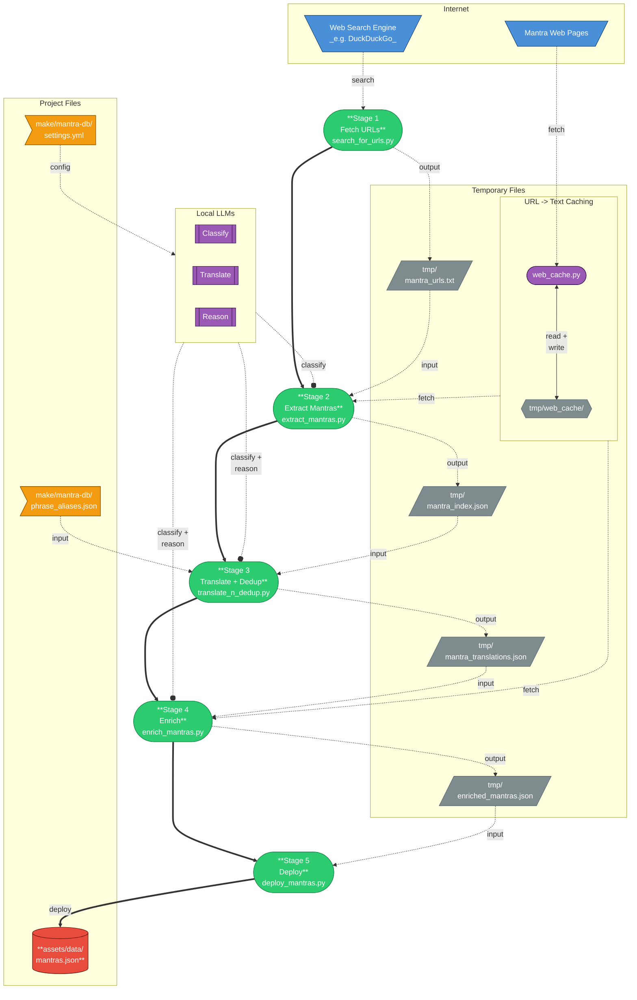

# Mantra DataBase Build

Five-stage pipeline for discovering, deduplicating, enriching, and deploying
Mantras into the myMantra DataBase.

tool parameters are driven by `settings.yml` — no hardcoded values exist in the scripts.

---

## Usage

```bash
make mantra-db                    # run stages 1–4 (default: all)
make mantra-db ARGS=deploy        # deploy enriched mantras to assets/data/mantras.json
make mantra-db ARGS=clean         # remove all tmp/ pipeline outputs
make mantra-db ARGS=prerequisites # check pip packages and Ollama models
```

---

## Pipeline overview



---

## `settings.yml` — single source of truth

Every tunable parameter lives here. Edit this file to change behaviour;
no script changes are needed.

| Stage | Section | Key | What it controls |
|---|---|---|---|
| — | `python.packages` | list | pip packages checked by `prerequisites` |
| — | `ollama.host` | URL | Ollama server hostname (default `http://localhost`) |
| — | `ollama.port` | int | Ollama server port (default `11434`) |
| 1 | `search_web.output` | path | URL list written by Stage 1 |
| 1 | `search_web.locales` | list of `{locale, search}` | locales and search terms for Stage 1 |
| 1 | `search_web.delay` | float (sec) | polite delay between WSE requests |
| 1 | `search_web.results_per_locale` | int | max URLs fetched per search term |
| 1 | `search_web.cache_dir` | path | HTML cache directory |
| 2 | `extract_mantra.input` | path | URL list consumed by Stage 2 |
| 2 | `extract_mantra.output` | path | raw mantra index written by Stage 2 |
| 2 | `extract_mantra.llm_engines` | list | Ollama models used for extraction |
| 2 | `extract_mantra.delay` | float (sec) | polite delay between page fetches |
| 2 | `extract_mantra.max_page_chars` | int | page text truncation limit |
| 2 | `extract_mantra.cache_dir` | path | HTML cache directory (shared with Stage 1) |
| 3 | `translate_n_dedup.input` | path | raw index consumed by Stage 3 |
| 3 | `translate_n_dedup.output` | path | deduplicated index written by Stage 3 |
| 3 | `translate_n_dedup.aliases` | filename | romanisation alias rules file |
| 3 | `translate_n_dedup.system` | string | shared system prompt with `{source language}` / `{target language}` placeholders |
| 3 | `translate_n_dedup.english` | dict | step 1 config: `task`, `llm_engine`, `llm_options` (temperature, num_ctx, timeout) |
| 3 | `translate_n_dedup.transliteration` | dict | step 3 config: `task`, `llm_engine`, `llm_options` |
| 3 | `translate_n_dedup.translations` | dict | step 4 config: `llm_engine`, `llm_options`, `languages` (with `task` + `{code: name}` pairs) |
| 4 | `enrich_mantras.input` | path | deduplicated index consumed by Stage 4 |
| 4 | `enrich_mantras.output` | path | enriched records written by Stage 4 |
| 4 | `enrich_mantras.http_timeout` | int (sec) | HTTP timeout for source fetching |
| 4 | `enrich_mantras.context_filter` | dict | step 0: `llm_filter`, `system`, `llm_timeout`, `llm_temperature`, `chunk_mode`, `min_chunk_len`, `max_chunk_len` |
| 4 | `enrich_mantras.assignments` | dict | step 1: `llm_students`, `system`, then per-field dicts with `task`, `llm_temperature`, `llm_timeout` |
| 4 | `enrich_mantras.grader_options` | dict | step 2: `llm_grader`, `system`, `llm_timeout`, `llm_temperature`, `weights` |
| 5 | `deploy.input` | path | enriched records consumed by Stage 5 |
| 5 | `deploy.output` | path | final library file written by Stage 5 |

All `input`/`output` paths are relative to the project root and resolved
to absolute paths at runtime via `settings.py`.

---

## Stage 1 — `search_for_urls.py`

Searches DuckDuckGo across world locales using culturally relevant search
terms in each local language. Collects ~10 URLs per search term,
deduplicates across all locales, and writes
a flat URL list to `tmp/mantra_urls.txt`.

```bash
python3 make/mantra-db/search_for_urls.py               # search all locales
python3 make/mantra-db/search_for_urls.py --no-cache    # re-fetch (bypass cache)
python3 make/mantra-db/search_for_urls.py --verbose     # print each URL as found
python3 make/mantra-db/search_for_urls.py --output path/to/urls.txt
```

Output: `tmp/mantra_urls.txt` — one URL per line, ~100–180 unique URLs.

---

## Stage 2 — `extract_mantras.py`

Reads `tmp/mantra_urls.txt`, fetches each page with curl, and asks a local
Ollama LLM to extract every mantra phrase with its language and tags.
Results are appended to `mantra_index.json`. Duplicates are intentional
at this stage — curation happens in Stage 3.

**Requires:**
```bash
pip install litellm
ollama pull qwen2.5:32b
```

```bash
python3 make/mantra-db/extract_mantras.py                        # process all URLs
python3 make/mantra-db/extract_mantras.py --limit 5 --verbose   # quick test
python3 make/mantra-db/extract_mantras.py --model ollama/gemma3:27b
python3 make/mantra-db/extract_mantras.py --input path/to/urls.txt
```

Output: `tmp/mantra_index.json` — flat JSON array, one record per
extracted mantra:

```json
{
  "phrase":       "Om Namah Shivaya",
  "language":     "Sanskrit",
  "tags":         ["devotion", "hindu", "popular", "shiva"],
  "source_url":   "https://example.com/hindu-mantras",
  "source_title": "Top 10 Hindu Mantras",
  "fetched_at":   "2026-03-07"
}
```

---

## Stage 3 — `translate_n_dedup.py`

Four-step async pipeline that normalises, deduplicates, transliterates, and
translates the raw mantra index. All LLM calls run sequentially to avoid
Ollama VRAM swapping. Each step has its own model, task prompt, and options
defined in `settings.yml` under `translate_n_dedup`.

The shared system prompt uses `{source language}` / `{target language}`
placeholders and the Answer/Grounding format (grounding is stripped,
only the answer is stored).

**Step 1 — Translate to English** (`english.llm_engine`):
Every phrase (in any language/script) is translated to its standard English
form. Entries that are not mantras (descriptions, grammar terms) are tagged
`NOT_A_MANTRA` and filtered out. Results are cached in
`tmp/mantra_english_cache.json` for resume.

**Step 2 — Dedup by canonical English form**:
Phrases are canonicalised using `phrase_aliases.json` (prefix + exact rules),
then grouped case-insensitively. Each group is merged losslessly:
- `language` becomes a list of all unique values seen
- `tags` is the union across all duplicates
- `sources` is a deduplicated list of `{url, title, fetched_at}`; each
  source entry includes `original_phrase` when it differs from the canonical

**Step 3 — Transliterate** (`transliteration.llm_engine`):
Each unique mantra is romanised with standard diacritics (ISO 15919 or
relevant standard). Results are cached in `tmp/mantra_translit_cache.json`.

**Step 4 — Full multi-language translation** (`translations.llm_engine`):
Each unique mantra is translated into all target languages (defined in
`translations.languages`). Each language is a separate LLM call for
focused, high-quality output.

**Requires:**
```bash
pip install litellm pyyaml tqdm
ollama pull translategemma:27b   # english translation
ollama pull translategemma:12b   # transliteration
ollama pull translategemma:27b   # multi-language translation
```

```bash
python3 make/mantra-db/translate_n_dedup.py
```

Output: `tmp/mantra_index_deduped.json` — a JSON object keyed by
canonical phrase:

```json
{
  "Om Namah Shivaya": {
    "phrase":    "Om Namah Shivaya",
    "language":  ["Sanskrit"],
    "tags":      ["devotion", "hindu", "shiva"],
    "transliteration": "oṃ namaḥ śivāya",
    "original":  "ॐ नमः शिवाय",
    "english":   "I bow to Shiva",
    "translations": { "en": "...", "es": "...", ... },
    "sources": [
      {
        "url":             "https://example.com/...",
        "title":           "Hindu Mantras",
        "fetched_at":      "2026-03-07",
        "original_phrase": "Ohm Namah Shivaya"
      }
    ]
  }
}
```

### `phrase_aliases.json`

Human-editable alias file consumed by `translate_n_dedup.py`:

```json
{
  "prefix_rules": [
    ["Ohm ", "Om "],
    ["Ohn ", "Om "],
    ["Oṃ ",  "Om "],
    ["Aum ", "Om "]
  ],
  "exact_rules": {
    "Ohm": "Om",
    "Aum": "Om",
    ...
  }
}
```

`prefix_rules` are applied first (in order); `exact_rules` handle
standalone words and decorated forms.

---

## Stage 4 — `enrich_mantras.py`

Four-step enrichment pipeline. For every entry in
`mantra_index_deduped.json`, produces a full library record. All LLM calls
use dynamic `num_ctx` sized to the actual input + 4K output reserve.

**Fetch — Source text extraction**:
Fetches source URLs (already known from earlier stages) with curl +
trafilatura, caching both HTML and extracted text under `tmp/crawl_cache/`.

**Step 0 — Context filter** (`context_filter.llm_filter`):
Chunks all source texts per mantra into paragraphs (configurable min/max
length). A lightweight LLM answers true/false per chunk for relevance to
the mantra phrase. Only relevant chunks are concatenated into a single
filtered context — shared by all students and the grader.

**Step 1 — Student assignments** (`assignments.llm_students`):
Each student model answers every assignment (background, benefits, tags,
tradition, difficulty, targetRepetitions) using the pre-filtered context.
Models are batched to avoid Ollama VRAM swapping. Each field has its own
`llm_temperature` and `llm_timeout`. Task prompts support `{key}` template
variables (e.g. `{min_answer_len}`, `{max_tags}`). Only the answer is
kept; grounding is discarded.

**Step 2 — Grading** (`grader_options.llm_grader`):
A grader model scores each student answer (0–100) using the Answer/Grounding
format against the same filtered context. Scores and per-model metrics are
saved for analysis.

**Step 3 — Combine + statistics**:
Best answer per field is selected. A scatter plot (`tmp/score_scatter.png`)
with one subplot per assignment and one series per student model shows
score vs time. A summary statistics table is logged.

**Requires:**
```bash
pip install litellm trafilatura tqdm
ollama pull qwen2.5:3b-instruct   # context filter
ollama pull phi3:14b               # student
ollama pull qwen3.5:9b             # student + grader
ollama pull gemma3:12b             # student
```

```bash
python3 make/mantra-db/enrich_mantras.py
```

The script is **crash-safe and resumable** — it saves answers to
`tmp/enrich_answers.json` after each pass and skips completed work on restart.

Output: `tmp/enriched_mantras.json` — JSON object keyed by phrase.

---

## Stage 5 — `deploy_mantras.py`

Deploys `tmp/enriched_mantras.json` into `assets/data/mantras.json` — the
versioned library file loaded by the Flutter app. This is a separate,
explicit Makefile target (`make deploy`) — not part of the default pipeline.

- Existing entries are matched by transliteration or name and updated
  in-place (enriched fields fill in blanks; tags and translations are unioned)
- New entries are appended with auto-generated IDs (must have required fields
  and a known tradition)
- Entries that failed LLM parsing are skipped with a warning
- Output is sorted by tradition then name

```bash
python3 make/mantra-db/deploy_mantras.py --dry-run   # stats only, no write
python3 make/mantra-db/deploy_mantras.py              # write assets/data/mantras.json
# or via Makefile:
make -f make/mantra-db/Makefile deploy
```

---

## Shared infrastructure

| Path | Purpose |
|---|---|
| `tmp/mantra_urls.txt` | URL list produced by Stage 1, consumed by Stage 2 |
| `tmp/mantra_index.json` | Raw discovery index produced by Stage 2 |
| `tmp/mantra_english_cache.json` | Phrase→English cache for Stage 3 step 1 (resumable) |
| `tmp/mantra_translit_cache.json` | Phrase→transliteration cache for Stage 3 step 3 (resumable) |
| `tmp/mantra_index_deduped.json` | Deduplicated + translated index produced by Stage 3 |
| `tmp/enriched_mantras.json` | Full library records produced by Stage 4 |
| `tmp/enrich_answers.json` | Student/grader answer cache for Stage 4 resume |
| `tmp/score_scatter.png` | Speed vs score scatter plot produced by Stage 4 |
| `make/mantra-db/phrase_aliases.json` | Human-editable romanisation alias rules |
| `make/mantra-db/settings.yml` | Single source of truth for all pipeline parameters |
| `make/mantra-db/settings.py` | Shared config loader (`cfg()`, `root_path()`, `ollama()`, `llm_kwargs()`) |
| `tmp/crawl_cache/` | HTML cache shared by Stages 1, 2, and 4 (avoids re-fetching) |

The crawl cache uses `md5(url)` as filename, so both scripts reuse each
other's cached pages automatically.
